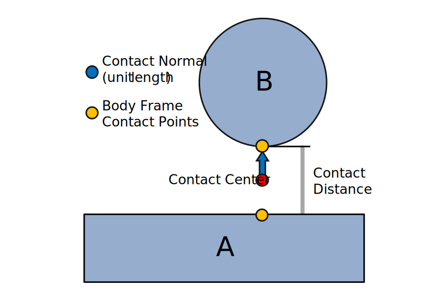
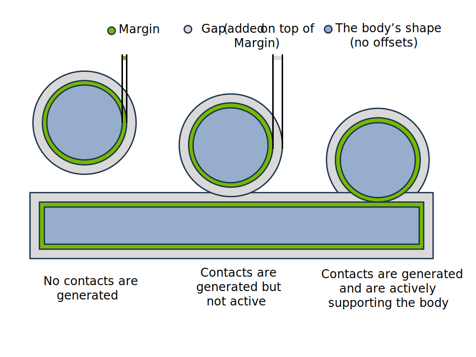

.. SPDX-FileCopyrightText: Copyright (c) 2025 The Newton Developers
.. SPDX-License-Identifier: CC-BY-4.0

.. currentmodule:: newton

.. _Collisions:

Collisions
==========

Newton provides a GPU-accelerated collision detection system with:

- **Full shape-pair coverage** — every shape type collides with every other shape type
  (see :ref:`Shape Compatibility`).
- **Mesh-mesh contacts** via precomputed SDFs for O(1) distance queries on complex
  geometry.
- **Hydroelastic contacts** that sample contacts across the contact surface for improved
  fidelity in torsional friction and force distribution, especially in non-convex and
  manipulation scenarios.
- **Drop-in replacement for MuJoCo's contacts** — use Newton's pipeline with
  :class:`~solvers.SolverMuJoCo` for advanced contact models (see
  :ref:`MuJoCo Warp Integration`).

This page starts with a :ref:`conceptual overview <Collision Overview>` of how geometry
representations and narrow phase algorithms combine, then covers each stage in detail.

.. _Collision Overview:

Conceptual Overview
-------------------

Newton's collision pipeline runs in two stages: a **broad phase** that quickly
eliminates shape pairs whose bounding boxes do not overlap, followed by a **narrow
phase** that computes the actual contact geometry for surviving pairs.

The narrow phase algorithm used for a given pair depends on how the shapes are
represented:

.. mermaid::
   :config: {"theme": "forest", "themeVariables": {"lineColor": "#76b900"}}

   flowchart LR
     BP["Broad Phase (AABB culling)"] --> Triage
     subgraph Triage ["Pair Triage"]
       G1["Convex / primitive pairs"]
       G2["Mesh pairs (BVH or SDF)"]
     end
     subgraph NP ["Narrow Phase"]
       A["MPR / GJK"]
       B["Distance queries + contact reduction"]
       C["Hydroelastic + contact reduction"]
     end
     G1 --> A --> Contacts
     G2 --> B --> Contacts
     G2 -.->|"both shapes hydroelastic"| C --> Contacts

**Geometry representations**

1. **Convex hulls and primitives** — sphere, box, capsule, cylinder, cone, ellipsoid,
   and convex mesh shapes expose canonical support functions. These feed directly into
   the **MPR/GJK** narrow phase which produces contact points without further reduction.
   See :ref:`Narrow Phase`.

2. **Live BVH queries** — triangle meshes that do *not* have a precomputed SDF are
   queried through Warp's BVH (Bounding Volume Hierarchy). This path computes on-the-fly
   distance queries and generates contacts with optional contact reduction. It works out
   of the box but can be slow for high-triangle-count meshes. Hydroelastic contacts are
   **not** available on this path. See :ref:`Mesh Collisions`.

3. **Precomputed SDFs** — calling ``mesh.build_sdf(...)`` on a mesh precomputes a
   signed distance field that provides O(1) distance lookups. Primitive shapes can also
   generate SDF grids via ``ShapeConfig`` SDF parameters (see :ref:`Shape Configuration`).
   This path supports both **distance-query** and **hydroelastic** contact generation
   (with contact reduction). Hydroelastic contacts require SDF on *both* shapes in a
   pair. See :ref:`Mesh Collisions` and :ref:`Hydroelastic Contacts`.

.. note::
   **Contact reduction** applies to the SDF-based and hydroelastic paths where many raw
   contacts are generated from distance field queries. The direct MPR/GJK path for
   convex pairs produces a small number of contacts and does not require reduction. See
   :ref:`Contact Reduction`.

.. tip::
   For scenes with expensive collision (SDF or hydroelastic), running ``collide`` once
   per frame instead of every substep can significantly improve performance. See
   :ref:`Common Patterns` for the different collision-frequency patterns.

.. _Contact Model:

Contact Geometry
^^^^^^^^^^^^^^^^

The output of the narrow phase is a set of **contacts**: lightweight geometric
descriptors that decouple the solver from the underlying shape complexity. A mesh may
contain hundreds of thousands of triangles, but the collision pipeline distills the
interaction into a manageable number of contacts that the solver can process efficiently.

Each contact carries the following geometric data:

   A contact between two shapes (A and B). The **contact normal** (blue, unit length)
   points from shape A to shape B. **Body-frame contact points** (yellow) are stored in
   each body's local frame. The **contact midpoint** (red) — the average of the two
   world-space contact points — is not stored but is useful for visualization and
   debugging. The **contact distance** encodes the signed separation or penetration depth.

- **Contact normal** (world frame) — a unit vector pointing from shape A toward shape B.
- **Contact points** (body frame) — the contact location on each shape
  (``rigid_contact_point0/1``), stored in the parent body's local coordinate frame.
- **Contact distance** — the signed separation between the two contact points along the
  normal. Negative values indicate penetration.

Because contacts are self-contained geometric objects, the solver never needs to query
mesh triangles or SDF grids — it only works with the contact arrays stored in
:class:`~Contacts`. See :ref:`Contact Generation` for the full data layout.

.. _MuJoCo Warp Integration:

MuJoCo Warp Integration
^^^^^^^^^^^^^^^^^^^^^^^^

:class:`~solvers.SolverMuJoCo` (the MuJoCo Warp backend) ships with its own
built-in collision pipeline that handles convex primitive contacts. For many use cases
this is sufficient and requires no extra setup.

Newton's collision pipeline can also **replace** MuJoCo's contact generation, enabling
SDF-based mesh-mesh contacts and hydroelastic contacts that MuJoCo's built-in pipeline
does not support.

Examples:

- **Hydroelastic mesh contacts** —
  :github:`newton/examples/contacts/example_nut_bolt_hydro.py`
- **SDF mesh contacts** —
  :github:`newton/examples/contacts/example_nut_bolt_sdf.py`
- **Robot manipulation with SDF** —
  :github:`newton/examples/contacts/example_brick_stacking.py`

See :ref:`Solver Integration` for the full code pattern showing how to configure
this.

.. _Collision Pipeline:

Collision Pipeline
------------------

Newton's collision pipeline implementation supports multiple broad phase algorithms and advanced contact models (SDF-based, hydroelastic, cylinder/cone primitives). See :ref:`Collision Pipeline Details` for details.

Basic usage:

.. testsetup:: pipeline-basics

    import warp as wp
    import newton

    builder = newton.ModelBuilder()
    builder.add_ground_plane()
    body = builder.add_body(xform=wp.transform((0.0, 0.0, 2.0), wp.quat_identity()))
    builder.add_shape_sphere(body, radius=0.5)
    model = builder.finalize()
    state = model.state()

.. testcode:: pipeline-basics

    # Default: creates CollisionPipeline with EXPLICIT broad phase (precomputed pairs)
    contacts = model.contacts()
    model.collide(state, contacts)

    # Or create a pipeline explicitly to choose broad phase mode
    from newton import CollisionPipeline

    pipeline = CollisionPipeline(
        model,
        broad_phase="sap",
    )
    contacts = pipeline.contacts()
    pipeline.collide(state, contacts)

.. _Quick Start:

Quick Start
-----------

A minimal end-to-end example that creates shapes, runs collision detection, and steps the
solver (see also the :doc:`Introduction tutorial </tutorials/00_introduction>` and
``example_basic_shapes.py`` — :github:`newton/examples/basic/example_basic_shapes.py`):

.. testcode:: quickstart

    import warp as wp
    import newton

    builder = newton.ModelBuilder()
    builder.add_ground_plane()

    # Dynamic sphere
    body = builder.add_body(xform=wp.transform((0.0, 0.0, 2.0), wp.quat_identity()))
    builder.add_shape_sphere(body, radius=0.5)

    model = builder.finalize()
    solver = newton.solvers.SolverXPBD(model, iterations=5)

    state_0 = model.state()
    state_1 = model.state()
    control = model.control()
    contacts = model.contacts()

    dt = 1.0 / 60.0 / 10.0
    for frame in range(120):
        for substep in range(10):
            state_0.clear_forces()
            model.collide(state_0, contacts)
            solver.step(state_0, state_1, control, contacts, dt)
            state_0, state_1 = state_1, state_0

.. _Supported Shape Types:

Supported Shape Types
---------------------

Newton supports the following geometry types via :class:`~GeoType`:

.. list-table::
   :header-rows: 1
   :widths: 20 80

   * - Type
     - Description
   * - ``PLANE``
     - Infinite plane (ground)
   * - ``HFIELD``
     - Heightfield terrain (2D elevation grid)
   * - ``SPHERE``
     - Sphere primitive
   * - ``CAPSULE``
     - Cylinder with hemispherical ends
   * - ``BOX``
     - Axis-aligned box
   * - ``CYLINDER``
     - Cylinder
   * - ``CONE``
     - Cone
   * - ``ELLIPSOID``
     - Ellipsoid
   * - ``MESH``
     - Triangle mesh (arbitrary, including non-convex)
   * - ``CONVEX_MESH``
     - Convex hull mesh

.. note::
   **SDF is collision data, not a standalone shape type.** For mesh shapes, build and attach
   an SDF explicitly with ``mesh.build_sdf(...)`` and then pass that mesh to
   ``builder.add_shape_mesh(...)``. For primitive hydroelastic workflows, SDF generation uses
   ``ShapeConfig`` SDF parameters.

.. _Shapes and Bodies:

Shapes and Rigid Bodies
-----------------------

Collision shapes are attached to rigid bodies. Each shape has:

- **Body index** (``shape_body``): The rigid body this shape is attached to. Use ``body=-1`` for static/world-fixed shapes.
- **Local transform** (``shape_transform``): Position and orientation relative to the body frame.
- **Scale** (``shape_scale``): 3D scale factors applied to the shape geometry.
- **Margin** (``shape_margin``): Surface offset that shifts where contact points are placed. See :ref:`Margin and gap semantics <margin-gap-semantics>`.
- **Gap** (``shape_gap``): Extra detection distance that shifts when contacts are generated. See :ref:`Margin and gap semantics <margin-gap-semantics>`.
- **Source geometry** (``shape_source``): Reference to the underlying geometry object (e.g., :class:`~Mesh`).

During collision detection, shapes are transformed to world space using their parent body's pose:

.. code-block:: python

    # Shape world transform = body_pose * shape_local_transform
    X_world_shape = body_q[shape_body] * shape_transform[shape_id]

Contacts are generated between shapes, not bodies. Depending on the type of solver, the motion of the bodies is affected by forces or constraints that resolve the penetrations between their attached shapes.

.. _Collision Filtering:

Collision Filtering
-------------------

The collision pipeline uses filtering rules based on world indices and collision groups.

.. _World IDs:

World Indices
^^^^^^^^^^^^^

World indices enable multi-world simulations, primarily for reinforcement learning, where objects belonging to different worlds coexist but do not interact through contacts:

- **Index -1**: Global entities that collide with all worlds (e.g., ground plane)
- **Index 0, 1, 2, ...**: World-specific entities that only interact within their world

.. testcode:: world-indices

    builder = newton.ModelBuilder()
    
    # Global ground (default world -1, collides with all worlds)
    builder.add_ground_plane()
    
    # Robot template
    robot_builder = newton.ModelBuilder()
    body = robot_builder.add_link()
    robot_builder.add_shape_sphere(body, radius=0.5)
    joint = robot_builder.add_joint_free(body)
    robot_builder.add_articulation([joint])
    
    # Instantiate in separate worlds - robots won't collide with each other
    builder.add_world(robot_builder)  # World 0
    builder.add_world(robot_builder)  # World 1

    model = builder.finalize()

For heterogeneous worlds, use :meth:`~ModelBuilder.begin_world` and :meth:`~ModelBuilder.end_world`.

For large-scale parallel simulations (e.g., RL), :meth:`~ModelBuilder.replicate` stamps
out many copies of a template environment builder into separate worlds in one call:

.. testcode:: replicate

    # Template environment: one sphere per world
    env_builder = newton.ModelBuilder()
    body = env_builder.add_body()
    env_builder.add_shape_sphere(body, radius=0.5)

    # Combined builder: global geometry + 1024 replicated worlds
    main = newton.ModelBuilder()
    main.add_ground_plane()  # global (world -1), shared across all worlds
    main.replicate(env_builder, world_count=1024)
    model = main.finalize()

.. note::
   MJWarp does not currently support heterogeneous environments (different models per world).

World indices are stored in :attr:`~Model.shape_world`, :attr:`~Model.body_world`, etc.

.. _Collision Groups:

Collision Groups
^^^^^^^^^^^^^^^^

Collision groups control which shapes collide within the same world:

- **Group 0**: Collisions disabled
- **Positive groups (1, 2, ...)**: Collide with same group or any negative group
- **Negative groups (-1, -2, ...)**: Collide with shapes in any positive or negative group, except shapes in the same negative group

.. list-table::
   :header-rows: 1
   :widths: 15 15 15 55

   * - Group A
     - Group B
     - Collide?
     - Reason
   * - 0
     - Any
     - ❌
     - Group 0 disables collision
   * - 1
     - 1
     - ✅
     - Same positive group
   * - 1
     - 2
     - ❌
     - Different positive groups
   * - 1
     - -2
     - ✅
     - Positive with any negative
   * - -1
     - -1
     - ❌
     - Same negative group
   * - -1
     - -2
     - ✅
     - Different negative groups

.. testcode:: collision-groups

    builder = newton.ModelBuilder()
    
    # Group 1: only collides with group 1 and negative groups
    body1 = builder.add_body()
    builder.add_shape_sphere(body1, radius=0.5, cfg=builder.ShapeConfig(collision_group=1))
    
    # Group -1: collides with everything (except other -1)
    body2 = builder.add_body()
    builder.add_shape_sphere(body2, radius=0.5, cfg=builder.ShapeConfig(collision_group=-1))

    model = builder.finalize()

**Self-collision within articulations**

Self-collisions within an articulation can be enabled or disabled with ``enable_self_collisions`` when loading models. By default, adjacent body collisions (parent-child pairs connected by joints) are disabled via ``collision_filter_parent=True``.

.. code-block:: python

    # Enable self-collisions when loading models
    builder.add_usd("robot.usda", enable_self_collisions=True)
    builder.add_mjcf("robot.xml", enable_self_collisions=True)
    
    # Or control per-shape (also applies to max-coordinate jointed bodies)
    cfg = builder.ShapeConfig(collision_group=-1, collision_filter_parent=False)

**Controlling particle collisions**

Use ``has_shape_collision`` and ``has_particle_collision`` for fine-grained control over what a shape collides with. Setting both to ``False`` is equivalent to ``collision_group=0``.

.. testcode:: particle-collision

    builder = newton.ModelBuilder()

    # Shape that only collides with particles (not other shapes)
    cfg = builder.ShapeConfig(has_shape_collision=False, has_particle_collision=True)
    
    # Shape that only collides with other shapes (not particles)
    cfg = builder.ShapeConfig(has_shape_collision=True, has_particle_collision=False)

UsdPhysics Collision Filtering
^^^^^^^^^^^^^^^^^^^^^^^^^^^^^^

Newton follows the `UsdPhysics collision filtering specification <https://openusd.org/dev/api/usd_physics_page_front.html#usdPhysics_collision_filtering>`_,
which provides two complementary mechanisms for controlling which shapes collide:

1. **Collision Groups** - Group-based filtering using ``UsdPhysicsCollisionGroup``
2. **Pairwise Filtering** - Explicit shape pair exclusions using ``physics:filteredPairs``

**Collision Groups**

In UsdPhysics, shapes can be assigned to collision groups defined by ``UsdPhysicsCollisionGroup`` prims.
When importing USD files, Newton reads the ``collisionGroups`` attribute from each shape and maps
each unique collision group name to a positive integer ID (starting from 1). Shapes in different
collision groups will not collide with each other unless their groups are configured to interact.

.. code-block:: usda

    # Define a collision group in USD
    def "CollisionGroup_Robot" (
        prepend apiSchemas = ["PhysicsCollisionGroup"]
    ) {
    }

    # Assign shape to a collision group
    def Sphere "RobotPart" (
        prepend apiSchemas = ["PhysicsCollisionAPI"]
    ) {
        rel physics:collisionGroup = </CollisionGroup_Robot>
    }

When loading this USD, Newton automatically assigns each collision group a unique integer ID
and sets the shape's ``collision_group`` accordingly.

**Pairwise Filtering**

For fine-grained control, UsdPhysics supports explicit pair filtering via the ``physics:filteredPairs``
relationship. This allows excluding specific shape pairs from collision detection regardless of their
collision groups.

.. code-block:: usda

    # Exclude specific shape pairs in USD
    def Sphere "ShapeA" (
        prepend apiSchemas = ["PhysicsCollisionAPI"]
    ) {
        rel physics:filteredPairs = [</ShapeB>]
    }

Newton reads these relationships during USD import and converts them to
:attr:`~ModelBuilder.shape_collision_filter_pairs`.

**Collision Enabled Flag**

Shapes with ``physics:collisionEnabled=false`` are excluded from all collisions by adding filter
pairs against all other shapes in the scene.

Shape Collision Filter Pairs
^^^^^^^^^^^^^^^^^^^^^^^^^^^^

The :attr:`~ModelBuilder.shape_collision_filter_pairs` list stores explicit shape pair exclusions.
This is Newton's internal representation for pairwise filtering (including pairs imported from
UsdPhysics ``physics:filteredPairs`` relationships).

.. testcode:: filter-pairs

    builder = newton.ModelBuilder()
    
    # Add shapes
    body = builder.add_body()
    shape_a = builder.add_shape_sphere(body, radius=0.5)
    shape_b = builder.add_shape_box(body, hx=0.5, hy=0.5, hz=0.5)

    # Exclude this specific pair from collision detection
    builder.add_shape_collision_filter_pair(shape_a, shape_b)

Filter pairs are automatically populated in several cases:

- **Adjacent bodies**: Parent-child body pairs connected by joints (when
  ``collision_filter_parent=True``). For USD joints with two explicit bodies,
  ``physics:collisionEnabled`` controls this filter with inverse polarity; joints to world do not
  create a body-pair filter. Also applies to max-coordinate jointed bodies.
- **Same-body shapes**: Shapes attached to the same rigid body
- **Disabled self-collision**: All shape pairs within an articulation when ``enable_self_collisions=False``
- **USD filtered pairs**: Pairs defined by ``physics:filteredPairs`` relationships in USD files
- **USD collision disabled**: Shapes with ``physics:collisionEnabled=false`` (filtered against all other shapes)

The resulting filter pairs are stored in :attr:`~Model.shape_collision_filter_pairs` as a set of
``(shape_index_a, shape_index_b)`` tuples (canonical order: ``a < b``).

.. deprecated:: 1.4
   Mutating this finalized-model set is deprecated; update
   :attr:`~ModelBuilder.shape_collision_filter_pairs` before calling ``finalize()`` and rebuild the
   model instead, because the precomputed :attr:`~Model.shape_contact_pairs` array is not rebuilt by
   post-finalize filter edits.

**USD Import Example**

.. code-block:: python

    # Newton automatically imports UsdPhysics collision filtering
    builder = newton.ModelBuilder()
    builder.add_usd("scene.usda")
    
    # Collision groups and filter pairs are now populated:
    # - shape_collision_group: integer IDs mapped from UsdPhysicsCollisionGroup
    # - shape_collision_filter_pairs: pairs from physics:filteredPairs relationships
    
    model = builder.finalize()

.. _Collision Pipeline Details:

Broad Phase and Shape Compatibility
-----------------------------------

:class:`~CollisionPipeline` provides configurable broad phase algorithms:

.. list-table::
   :header-rows: 1
   :widths: 15 85

   * - Mode
     - Description
   * - **NxN**
     - All-pairs AABB broad phase. O(N²), optimal for small scenes (<100 shapes).
   * - **SAP**
     - Sweep-and-prune AABB broad phase. O(N log N), better for larger scenes with spatial coherence.
   * - **EXPLICIT**
     - Uses precomputed shape pairs (default). Combines static pair efficiency with advanced contact algorithms.

.. testsetup:: broad-phase

    import warp as wp
    import newton

    builder = newton.ModelBuilder()
    builder.add_ground_plane()
    body = builder.add_body(xform=wp.transform((0.0, 0.0, 2.0), wp.quat_identity()))
    builder.add_shape_sphere(body, radius=0.5)
    model = builder.finalize()
    state = model.state()

.. testcode:: broad-phase

    from newton import CollisionPipeline

    # Default: EXPLICIT (precomputed pairs)
    pipeline = CollisionPipeline(model)

    # NxN for small scenes
    pipeline = CollisionPipeline(model, broad_phase="nxn")

    # SAP for larger scenes
    pipeline = CollisionPipeline(model, broad_phase="sap")

    contacts = pipeline.contacts()
    pipeline.collide(state, contacts)

.. _Shape Compatibility:

Shape Compatibility
^^^^^^^^^^^^^^^^^^^

Shape compatibility summary (rigid + soft particle-shape):

.. list-table::
   :header-rows: 1
   :widths: 11 7 7 7 7 7 7 7 7 7 7 7 7

   * -
     - Plane
     - HField
     - Sphere
     - Capsule
     - Box
     - Cylinder
     - Cone
     - Ellipsoid
     - ConvexHull
     - Mesh
     - SDF
     - Particle
   * - **Plane**
     - [1]
     - [1]
     - ✅
     - ✅
     - ✅
     - ✅
     - ✅
     - ✅
     - ✅
     - ✅
     - ✅
     - ✅
   * - **HField**
     - [1]
     - [1]
     - ✅
     - ✅
     - ✅
     - ✅
     - ✅
     - ✅
     - ✅
     - ✅⚠️
     - ✅
     - ✅
   * - **Sphere**
     - ✅
     - ✅
     - ✅
     - ✅
     - ✅
     - ✅
     - ✅
     - ✅
     - ✅
     - ✅
     - ✅
     - ✅
   * - **Capsule**
     - ✅
     - ✅
     - ✅
     - ✅
     - ✅
     - ✅
     - ✅
     - ✅
     - ✅
     - ✅
     - ✅
     - ✅
   * - **Box**
     - ✅
     - ✅
     - ✅
     - ✅
     - ✅
     - ✅
     - ✅
     - ✅
     - ✅
     - ✅
     - ✅
     - ✅
   * - **Cylinder**
     - ✅
     - ✅
     - ✅
     - ✅
     - ✅
     - ✅
     - ✅
     - ✅
     - ✅
     - ✅
     - ✅
     - ✅
   * - **Cone**
     - ✅
     - ✅
     - ✅
     - ✅
     - ✅
     - ✅
     - ✅
     - ✅
     - ✅
     - ✅
     - ✅
     - ✅
   * - **Ellipsoid**
     - ✅
     - ✅
     - ✅
     - ✅
     - ✅
     - ✅
     - ✅
     - ✅
     - ✅
     - ✅
     - ✅
     - ✅
   * - **ConvexHull**
     - ✅
     - ✅
     - ✅
     - ✅
     - ✅
     - ✅
     - ✅
     - ✅
     - ✅
     - ✅
     - ✅
     - ✅
   * - **Mesh**
     - ✅
     - ✅⚠️
     - ✅
     - ✅
     - ✅
     - ✅
     - ✅
     - ✅
     - ✅
     - ✅⚠️
     - ✅⚠️
     - ✅
   * - **SDF**
     - ✅
     - ✅
     - ✅
     - ✅
     - ✅
     - ✅
     - ✅
     - ✅
     - ✅
     - ✅⚠️
     - ✅
     - ✅
   * - **Particle**
     - ✅
     - ✅
     - ✅
     - ✅
     - ✅
     - ✅
     - ✅
     - ✅
     - ✅
     - ✅
     - ✅
     - [2]

**Legend:** ⚠️ = Can be slow for meshes with high triangle counts; performance can
often be improved by attaching a precomputed SDF to the mesh (``mesh.build_sdf(...)``).

| [1] Plane and heightfield shapes are static (world-attached) in Newton; static-static pairs are filtered from rigid collision generation.
| [2] Particle-particle interactions are handled by the particle/soft-body solver self-collision path, not by the shape compatibility pipeline in this table.

.. note::
   ``Particle`` in this table refers to soft particle-shape contacts generated
   automatically by the collision pipeline. These contacts additionally require
   the shape to have particle collision enabled
   (``ShapeFlags.COLLIDE_PARTICLES`` / ``ShapeConfig.has_particle_collision``).
   For examples, see cloth and cable scenes that use the collision pipeline for
   particle-shape contacts.

.. note::
   **Heightfield representation:** A heightfield (``HFIELD``) stores a regular 2D grid
   of elevation samples. For rigid contacts, Newton uses dedicated heightfield
   narrow-phase routes: heightfield-vs-convex uses per-cell triangle GJK/MPR, while
   mesh-vs-heightfield routes through the mesh/SDF path with on-the-fly triangle
   extraction from the grid. For soft contacts, the collision pipeline automatically
   samples the heightfield signed distance and normal.

.. note::
   **SDF** in this table refers to shapes with precomputed SDF data. There is no
   ``GeoType.SDF`` enum value; this row is a conceptual collision mode for shapes
   carrying SDF resources. Mesh SDFs are attached through ``mesh.build_sdf(...)``
   and provide O(1) distance queries.

.. _Narrow Phase:

Narrow Phase Algorithms
-----------------------

After broad phase identifies candidate pairs, the narrow phase generates contact points.
The algorithm used depends on the shape types in each pair.

.. _Convex Primitive Contacts:

Convex Primitive Contacts
^^^^^^^^^^^^^^^^^^^^^^^^^

**MPR (Minkowski Portal Refinement) and GJK**

MPR is the primary algorithm for convex shape pairs. It uses support mapping functions to
find the closest points between shapes via Minkowski difference sampling. Works with all
convex primitives (sphere, box, capsule, cylinder, cone, ellipsoid) and convex meshes.
Newton uses MPR for penetration depth computation (not EPA); GJK handles the
separated-shapes distance query.

**Multi-contact generation**

For convex primitive pairs, multiple contact points are generated for stable stacking and
resting contacts. The collision pipeline estimates buffer sizes based on the model; you
can override this value with ``rigid_contact_max`` when instantiating the pipeline.

.. _Mesh Collisions:

Mesh Collision Handling
^^^^^^^^^^^^^^^^^^^^^^^

Mesh collisions use different strategies depending on the pair type:

**Mesh vs Primitive (e.g., Sphere, Box)**

Uses BVH (Bounding Volume Hierarchy) queries to find nearby triangles, then generates contacts between primitive vertices and triangle surfaces, plus triangle vertices against the primitive.

.. important::
   **Triangle winding order matters.** Newton uses counter-clockwise (CCW) winding
   to determine the outward face normal of each triangle. The collision pipeline
   performs back-face culling: when a convex shape is on the back side of a
   triangle (behind the face normal), the contact is discarded. This prevents
   shapes that tunnel through a mesh surface from being trapped by inverted
   contact normals.

   Supply mesh indices in CCW order when viewed from the outside of the surface.
   If your mesh has inconsistent or clockwise winding, convex shapes may pass
   through the surface without generating contacts.

**Mesh vs Plane**

Projects mesh vertices onto the plane and generates contacts for vertices below the plane surface.

**Mesh vs Mesh**

Two approaches available:

1. **BVH-based** (default when no SDF configured): Iterates mesh vertices against the other mesh's BVH. 
   Performance scales with triangle count - can be very slow for complex meshes.

2. **SDF-based** (recommended): Uses precomputed signed distance fields for fast queries.
   For mesh shapes, call ``mesh.build_sdf(...)`` once and reuse the mesh.

.. warning::
   If SDF is not precomputed, mesh-mesh contacts fall back to on-the-fly BVH distance queries
   which are **significantly slower**. For production use with complex meshes, precompute and
   attach SDF data on meshes:

   .. code-block:: python

       my_mesh.build_sdf(max_resolution=64)
       builder.add_shape_mesh(body, mesh=my_mesh)

.. tip::
   **Build an SDF on every mesh that can collide**, even when high-precision contacts are
   not required. A low-resolution SDF (e.g., ``max_resolution=64``) uses very little memory
   yet still provides O(1) distance queries that are dramatically faster than the BVH
   fallback. Without an SDF, mesh-vs-mesh and mesh-vs-primitive contacts must walk the BVH
   for every query point, which dominates collision cost in most scenes. Attaching even a
   coarse SDF eliminates this bottleneck.

:meth:`~Mesh.build_sdf` accepts several optional keyword arguments
(defaults shown in parentheses):

.. code-block:: python

    mesh.build_sdf(
        max_resolution=256,                   # Max voxels along longest AABB axis; must be divisible by 8 (None)
        narrow_band_range=(-0.005, 0.005),    # SDF narrow band [m] ((-0.1, 0.1))
        margin=0.005,                         # Extra AABB padding [m] (0.05)
        shape_margin=0.001,                   # Shrink SDF surface inward [m] (0.0)
        scale=(1.0, 1.0, 1.0),                # Bake non-unit scale into the SDF (None)
        edge_lower_angle_threshold_rad=math.radians(0.1),  # Drop near-coplanar edges below this angle (0.1 deg)
        edge_box_absorption=False,            # Drop edges fully covered by another edge's oriented box
    )

``max_resolution`` sets the voxel count along the longest AABB axis (must be divisible by 8);
voxel size is uniform across all axes. Use ``target_voxel_size`` instead to specify resolution
in meters directly — it takes precedence over ``max_resolution`` when both are provided. Use
``narrow_band_range`` to limit the SDF computation to a thin shell around the surface (saves
memory and build time). Set the SDF ``margin`` to at least the sum of the shape's :ref:`margin and gap <margin-gap-semantics>` so the SDF covers the
full contact detection range. Pass ``scale`` when the shape will be added with non-unit scale
to bake it into the SDF grid. ``shape_margin`` is mainly useful for hydroelastic collision
where a compliant-layer offset is desired.

**Edge simplification.** ``mesh.build_sdf(...)`` also runs a dihedral-angle pre-filter over
the mesh's manifold edges and caches the surviving subset on the mesh; the SDF-mesh contact
pipeline picks up that cached set in preference to the unfiltered :attr:`~Mesh.edges`,
which materially reduces edge-vs-shape work for typical CAD or scanned meshes. The default
threshold (``edge_lower_angle_threshold_rad=math.radians(0.1)``) drops only edges that are
geometrically coplanar to within 0.1 degrees, so it is safe for most meshes; raise it to
prune more aggressively, set it to ``0`` to keep every manifold edge, or pass a negative
value (e.g. ``-1.0``) to opt out of the simplification pass entirely. Set
``edge_box_absorption=True`` to additionally drop manifold edges that are fully covered by
another nearby edge's oriented box — useful for densely tessellated curved surfaces.
``edge_box_half_normal``/``edge_box_half_normal_rel`` and
``edge_box_half_lateral``/``edge_box_half_lateral_rel`` tune the box extents (absolute
metres or fractions of the mesh AABB diagonal); see :meth:`~Mesh.build_sdf` for full
parameter docs.

**On-disk SDF cache.** Pass ``cache_dir`` to persist the cooked SDF and skip the cook on
subsequent runs:

.. code-block:: python

    mesh.build_sdf(max_resolution=64, cache_dir="./sdf_cache")

Entries are content-addressed by mesh data and build parameters; changing any of them
produces a fresh entry automatically. ``shape_margin`` is applied at sample time and is
not part of the cache key. The on-disk format is internal and may change between Newton
versions — caches are invalidated and re-cooked transparently.

.. note::
   **Watertight meshes are preferred.** An SDF works best on a closed
   surface, so meshes whose every edge is shared by exactly two triangles give the most
   reliable inside/outside classification. Newton detects this automatically via
   :attr:`~Mesh.is_watertight` and switches to a faster parity-based construction path
   when it applies. Non-watertight meshes fall back to the slower winding-number path;
   SDFs on terrain meshes work too, but mind the resolution (terrains have large
   extents so surface features are easy to under-resolve) and expect noticeably
   longer construction times.

**Mesh simplification for collision**

For imported models (URDF, MJCF, USD) whose visual meshes are too detailed for efficient
collision, :meth:`~ModelBuilder.approximate_meshes` replaces mesh collision shapes
with convex hulls, bounding boxes, or convex decompositions:

.. code-block:: python

    builder.add_usd("robot.usda")

    # Replace all collision meshes with convex hulls (default)
    builder.approximate_meshes()

    # Or target specific shapes and keep visual geometry
    builder.approximate_meshes(
        method="convex_hull",
        shape_indices=non_finger_shapes,
        keep_visual_shapes=True,
    )

Supported methods: ``"convex_hull"`` (default), ``"bounding_box"``, ``"bounding_sphere"``,
``"coacd"`` (convex decomposition), ``"vhacd"``.

.. note::
   ``approximate_meshes()`` modifies the builder's shape geometry in-place. By default
   (``keep_visual_shapes=False``), the original mesh is replaced for both collision and
   rendering. Pass ``keep_visual_shapes=True`` to preserve the original mesh as a
   visual-only shape alongside the simplified collision shape.

.. _Contact Reduction:

Contact Reduction
^^^^^^^^^^^^^^^^^

Contact reduction is enabled by default. For scenes with many mesh-mesh interactions that generate thousands of contacts, reduction selects a significantly smaller representative set that maintains stable contact behavior while improving solver performance.

**How it works:**

1. Contacts are binned by normal direction (polyhedron face directions)
2. Within each bin, contacts are scored by spatial distribution and penetration depth
3. Representative contacts are selected to preserve coverage and depth cues

To disable reduction, set ``reduce_contacts=False`` when creating the pipeline.

**Configuring contact reduction (HydroelasticSDF.Config):**

For hydroelastic and SDF-based contacts, use :class:`~geometry.HydroelasticSDF.Config` to tune reduction behavior:

.. testsetup:: hydro-config

    import warp as wp
    import newton
    from newton import CollisionPipeline

    builder = newton.ModelBuilder()
    builder.add_ground_plane()
    body = builder.add_body(xform=wp.transform((0.0, 0.0, 2.0), wp.quat_identity()))
    builder.add_shape_sphere(body, radius=0.5)
    model = builder.finalize()

.. testcode:: hydro-config

    from newton.geometry import HydroelasticSDF

    config = HydroelasticSDF.Config(
        reduce_contacts=True,           # Enable contact reduction (default)
        buffer_fraction=0.2,            # Reduce GPU buffer allocations (default: 1.0)
        normal_matching=True,           # Align reduced normals with aggregate force
        anchor_contact=False,           # Optional center-of-pressure anchor contact
    )

    pipeline = CollisionPipeline(model, sdf_hydroelastic_config=config)

**Other reduction options:**

.. list-table::
   :header-rows: 1
   :widths: 30 70

   * - Parameter
     - Description
   * - ``normal_matching``
     - Rotates selected contact normals so their weighted sum aligns with the aggregate force direction 
       from all unreduced contacts. Preserves net force direction after reduction. Default: True.
   * - ``anchor_contact``
     - Adds an anchor contact at the center of pressure for each normal bin to better preserve moments.
       Default: False.
   * - ``margin_contact_area``
     - Lower bound on contact area. Hydroelastic stiffness is ``area * k_eff``, but contacts 
       within the contact margin that are not yet penetrating (speculative contacts) have zero 
       geometric area. This provides a floor value so they still generate repulsive force. Default: 0.01.

.. _Shape Configuration:

Shape Configuration
-------------------

Shape collision behavior is controlled via :class:`~ModelBuilder.ShapeConfig`:

**Collision control:**

.. list-table::
   :header-rows: 1
   :widths: 30 70

   * - Parameter
     - Description
   * - ``collision_group``
     - Collision group ID. 0 disables collisions. Default: 1.
   * - ``collision_filter_parent``
     - Filter collisions with adjacent body (parent in articulation or connected via joint). Default: True.
   * - ``has_shape_collision``
     - Whether shape collides with other shapes. Default: True.
   * - ``has_particle_collision``
     - Whether shape collides with particles. Default: True.

**Geometry parameters:**

.. list-table::
   :header-rows: 1
   :widths: 25 75

   * - Parameter
     - Description
   * - ``margin``
     - Surface offset used by narrow phase. Pairwise effect is additive (``m_a + m_b``): contacts are evaluated against the signed distance to the margin-shifted surfaces, so resting separation is ``m_a + m_b``. Helps thin shells/cloth stability and reduces self-intersections. Default: 0.0.
   * - ``gap``
     - Additional detection threshold. Pairwise effect is additive (``g_a + g_b``). Broad phase expands each shape AABB by ``(margin + gap)`` per shape; narrow phase then keeps a candidate contact when ``d <= g_a + g_b`` (with ``d`` measured relative to margin-shifted surfaces). Increasing gap detects contacts earlier and helps reduce tunneling. Default: None (uses ``builder.rigid_gap``, which defaults to 0.1).
   * - ``is_solid``
     - Whether shape is solid or hollow. Affects inertia and SDF sign. Default: True.
   * - ``is_hydroelastic``
     - Whether the shape uses SDF-based hydroelastic contacts. Both shapes in a pair must have this enabled. See :ref:`Hydroelastic Contacts`. Default: False.
   * - ``kh``
     - Hydroelastic contact stiffness coefficient. Under the default linear
       pressure law, pressure scales with ``kh`` and penetration depth; contact
       force also scales with contact area. Default: 1.0e10.

.. _margin-gap-semantics:

**Margin and gap semantics (where vs when):**

- **Where contacts are placed** is controlled by ``margin``.
- **When contacts are generated** is controlled by ``gap``.

For a shape pair ``(a, b)``:

- Pair margin: ``m = margin_a + margin_b``
- Pair gap: ``g = gap_a + gap_b``
- Surface distance (true geometry, no offsets): ``s``
- Contact-space distance used by Newton: ``d = s - m``

Contacts are generated when:

.. math::

   d \leq g \quad\Leftrightarrow\quad s \leq (m + g)

Broad phase uses the same idea by expanding each shape AABB by:

.. math::

   margin_i + gap_i

This keeps broad-phase culling and narrow-phase contact generation consistent.
The solver enforces ``d >= 0``, so objects at rest settle with surfaces separated
by ``margin_a + margin_b``.

   Margin sets contact location (surface offset), while gap adds speculative
   detection distance on top of margin. Left: no contact generated. Middle:
   contact generated but not yet active. Right: active contact support.

**SDF configuration (primitive generation defaults):**

.. list-table::
   :header-rows: 1
   :widths: 30 70

   * - Parameter
     - Description
   * - ``sdf_max_resolution``
     - Maximum SDF grid dimension (must be divisible by 8) for primitive SDF generation.
   * - ``sdf_target_voxel_size``
     - Target voxel size for primitive SDF generation. Takes precedence over ``sdf_max_resolution``.
   * - ``sdf_narrow_band_range``
     - SDF narrow band distance range (inner, outer). Default: (-0.1, 0.1).

The :meth:`~ModelBuilder.ShapeConfig.configure_sdf` helper sets SDF and hydroelastic
options in one call:

.. testcode:: configure-sdf

    builder = newton.ModelBuilder()
    cfg = builder.ShapeConfig()
    cfg.configure_sdf(max_resolution=64, is_hydroelastic=True, kh=1.0e11)

Example (mesh SDF workflow):

.. code-block:: python

    cfg = builder.ShapeConfig(
        collision_group=-1,           # Collide with everything
        margin=0.001,                 # 1mm margin
        gap=0.01,                     # 1cm detection gap
    )
    my_mesh.build_sdf(max_resolution=64)
    builder.add_shape_mesh(body, mesh=my_mesh, cfg=cfg)

**Builder default gap:**

The builder's ``rigid_gap`` (default 0.1) applies to shapes without explicit ``gap``. Alternatively, use ``builder.default_shape_cfg.gap``.

.. _Common Patterns:

Common Patterns
---------------

**Creating static/ground geometry**

Use ``body=-1`` to attach shapes to the static world frame:

.. testcode:: static-geometry

    builder = newton.ModelBuilder()
    
    # Static ground plane
    builder.add_ground_plane()  # Convenience method
    
    # Or manually create static shapes
    builder.add_shape_plane(body=-1, xform=wp.transform_identity())
    builder.add_shape_box(body=-1, hx=5.0, hy=5.0, hz=0.1)  # Static floor

**Setting default shape configuration**

Use ``builder.default_shape_cfg`` to set defaults for all shapes:

.. testcode:: default-shape-cfg

    builder = newton.ModelBuilder()
    
    # Set defaults before adding shapes
    builder.default_shape_cfg.ke = 1.0e6
    builder.default_shape_cfg.kd = 1000.0
    builder.default_shape_cfg.mu = 0.5
    builder.default_shape_cfg.is_hydroelastic = True
    builder.default_shape_cfg.sdf_max_resolution = 64  # Primitive SDF defaults

**Collision frequency in the simulation loop**

There are two common patterns for when to call ``collide`` relative to the substep loop:

.. testsetup:: sim-loop

    import warp as wp
    import newton
    from newton import CollisionPipeline

    builder = newton.ModelBuilder()
    builder.add_ground_plane()
    body = builder.add_body(xform=wp.transform((0.0, 0.0, 2.0), wp.quat_identity()))
    builder.add_shape_sphere(body, radius=0.5)
    model = builder.finalize()
    solver = newton.solvers.SolverXPBD(model, iterations=5)
    pipeline = CollisionPipeline(model, broad_phase="sap")
    state_0 = model.state()
    state_1 = model.state()
    control = model.control()
    contacts = model.contacts()
    num_frames = 2
    sim_substeps = 3
    sim_dt = 1.0 / 60.0 / sim_substeps
    collide_every_n = 2

*Every substep* (most accurate, used by most basic examples):

.. testcode:: sim-loop

    for frame in range(num_frames):
        for substep in range(sim_substeps):
            model.collide(state_0, contacts)
            solver.step(state_0, state_1, control, contacts, dt=sim_dt)
            state_0, state_1 = state_1, state_0

*Once per frame* (faster, common for hydroelastic/SDF-heavy scenes):

.. testcode:: sim-loop

    for frame in range(num_frames):
        contacts = model.collide(state_0, collision_pipeline=pipeline)
        for substep in range(sim_substeps):
            solver.step(state_0, state_1, control, contacts, dt=sim_dt)
            state_0, state_1 = state_1, state_0

Another pattern is to run collision detection every N substeps for a middle ground:

.. testcode:: sim-loop

    for frame in range(num_frames):
        for substep in range(sim_substeps):
            if substep % collide_every_n == 0:
                pipeline.collide(state_0, contacts)
            solver.step(state_0, state_1, control, contacts, dt=sim_dt)
            state_0, state_1 = state_1, state_0

**Soft contacts (particle-shape)**

Soft contacts are generated automatically when particles are present. They use a separate margin:

.. testsetup:: soft-contacts

    import warp as wp
    import newton
    from newton import CollisionPipeline

    builder = newton.ModelBuilder()
    builder.add_ground_plane()
    builder.add_particle(pos=wp.vec3(0, 0, 1), vel=wp.vec3(0, 0, 0), mass=1.0)
    model = builder.finalize()
    state = model.state()

.. testcode:: soft-contacts

    # Set soft contact margin
    pipeline = CollisionPipeline(model, soft_contact_margin=0.01)
    contacts = pipeline.contacts()
    pipeline.collide(state, contacts)

    # Access soft contact data
    n_soft = contacts.soft_contact_count.numpy()[0]
    particles = contacts.soft_contact_particle.numpy()[:n_soft]
    shapes = contacts.soft_contact_shape.numpy()[:n_soft]

.. _Contact Generation:

Contact Data
------------

The :class:`~Contacts` class stores the results from the collision detection step
and is consumed by the solver :meth:`~solvers.SolverBase.step` method for contact handling.

**Rigid contacts:**

.. list-table::
   :header-rows: 1
   :widths: 35 65

   * - Attribute
     - Description
   * - ``rigid_contact_count``
     - Number of active rigid contacts (scalar).
   * - ``rigid_contact_shape0``, ``rigid_contact_shape1``
     - Indices of colliding shapes.
   * - ``rigid_contact_point0``, ``rigid_contact_point1``
     - Contact point on each shape (body frame). This is the narrow-phase contact
       location used by the solver for the normal constraint and lever-arm computation.
   * - ``rigid_contact_offset0``, ``rigid_contact_offset1``
     - Body-frame friction-anchor offset per shape, equal to the contact normal scaled
       by ``effective_radius + margin``. Added to the contact point to form a shifted
       friction anchor that accounts for rotational effects of finite contact thickness
       in tangential friction calculations.
   * - ``rigid_contact_normal``
     - Contact normal, pointing from shape 0 toward shape 1 (world frame).
   * - ``rigid_contact_margin0``, ``rigid_contact_margin1``
     - Per-shape thickness: effective radius + margin (scalar).
   * - ``rigid_contact_match_index``
     - Per-contact frame-to-frame match result (int32). ``>= 0``: matched old
       index, ``-1``: new, ``-2``: broken.  Only allocated when
       ``contact_matching`` is not ``"disabled"``.
       See :ref:`Contact Matching`.
   * - ``rigid_contact_new_indices``, ``rigid_contact_new_count``
     - Compact index list of new contacts in the current sorted buffer (where
       ``match_index < 0``). Only allocated when ``contact_report=True``.
       See :ref:`Contact Reports`.
   * - ``rigid_contact_broken_indices``, ``rigid_contact_broken_count``
     - Compact index list of contacts from the previous frame that no current
       contact matched. Only allocated when ``contact_report=True``.
       See :ref:`Contact Reports`.

**Soft contacts (particle-shape):**

.. list-table::
   :header-rows: 1
   :widths: 35 65

   * - Attribute
     - Description
   * - ``soft_contact_count``
     - Total number of soft contacts (single element). With full-surface contact off, this equals the per-particle contact count and is unchanged from earlier releases.
   * - ``soft_contact_indices``
     - Soft-side particle ids per contact, a ``vec3i`` with ``-1`` padding: ``(p, -1, -1)`` particle, ``(v0, v1, -1)`` edge, ``(v0, v1, v2)`` face. The number of non-negative slots gives the feature kind; pair with ``soft_contact_barycentric`` to recover the contact point.
   * - ``soft_contact_particle``
     - Particle id for particle contacts (``-1`` for edge/face records) — the particle-only view of ``soft_contact_indices``, for solvers that consume particle contacts exclusively.
   * - ``soft_contact_barycentric``
     - Barycentric weights of the contact point over the record's soft particles (``(1, 0, 0)`` for a particle contact).
   * - ``soft_contact_shape``
     - Shape indices.
   * - ``soft_contact_body_pos``, ``soft_contact_body_vel``
     - Contact position and velocity on shape.
   * - ``soft_contact_normal``
     - Contact normal.

**Extended contact attributes** (see :ref:`extended_contact_attributes`):

.. list-table::
   :header-rows: 1
   :widths: 22 78

   * - Attribute
     - Description
   * - :attr:`~Contacts.force`
     - Contact spatial forces (used by :class:`~sensors.SensorContact`).
       Populated by :meth:`~solvers.SolverBase.update_contacts`.

.. note::

   :class:`~solvers.SolverXPBD` with ``rigid_contact_con_weighting`` enabled
   (the default) does not conserve momentum at contacts.  The per-contact
   forces written by :meth:`~solvers.SolverXPBD.update_contacts` are
   approximate -- see that method's documentation for details.

Example usage:

.. testsetup:: contact-data

    import warp as wp
    import newton

    builder = newton.ModelBuilder()
    builder.add_ground_plane()
    body = builder.add_body(xform=wp.transform((0.0, 0.0, 2.0), wp.quat_identity()))
    builder.add_shape_sphere(body, radius=0.5)
    model = builder.finalize()
    state = model.state()

.. testcode:: contact-data

    contacts = model.contacts()
    model.collide(state, contacts)
    
    n = contacts.rigid_contact_count.numpy()[0]
    points0 = contacts.rigid_contact_point0.numpy()[:n]
    points1 = contacts.rigid_contact_point1.numpy()[:n]
    normals = contacts.rigid_contact_normal.numpy()[:n]
    
    # Shape indices
    shape0 = contacts.rigid_contact_shape0.numpy()[:n]
    shape1 = contacts.rigid_contact_shape1.numpy()[:n]

.. _Differentiable Contacts:

Differentiable Contacts
-----------------------

When ``requires_grad=True``, the :class:`~newton.Contacts` object provides an
additional set of **differentiable** rigid-contact arrays that participate in
:class:`wp.Tape` autodiff.  These arrays give first-order gradients of contact
distance and world-space contact points with respect to body poses
(``state.body_q``).

.. experimental::

   Rigid-contact differentiability may change without prior notice. Accuracy
   and fitness for real-world optimization or learning workflows should be
   validated case by case before relying on these gradients.

Making the full narrow-phase pipeline differentiable end-to-end would be
prohibitively expensive and numerically fragile — iterative GJK/MPR solvers,
BVH traversals, and discrete contact-set changes all introduce discontinuities
or ill-conditioned gradients.  Newton therefore keeps the narrow phase frozen
(``enable_backward=False``) and applies a lightweight **post-processing** step:
it re-reads the contact geometry produced by the narrow phase (body-local
points, world normal, margins) and reconstructs the world-space quantities
through the differentiable ``body_q``.  The result is a first-order
tangent-plane approximation that is cheap, stable, and sufficient for most
gradient-based optimization and reinforcement-learning workflows.

**Differentiable arrays** (allocated only when ``requires_grad=True``):

.. list-table::
   :header-rows: 1
   :widths: 40 60

   * - Attribute
     - Description
   * - ``rigid_contact_diff_distance``
     - Signed contact distance [m] (negative = penetration).
   * - ``rigid_contact_diff_normal``
     - World-space contact normal (A → B).
   * - ``rigid_contact_diff_point0_world``
     - World-space contact point on shape 0 [m].
   * - ``rigid_contact_diff_point1_world``
     - World-space contact point on shape 1 [m].

Gradients flow through the contact points and distance; the normal direction is
treated as a frozen constant.

.. testsetup:: diff-contacts

    import warp as wp
    import newton

.. testcode:: diff-contacts

    builder = newton.ModelBuilder(gravity=0.0)
    body = builder.add_body(xform=wp.transform((0.0, 0.0, 0.3)))
    builder.add_shape_sphere(body=body, radius=0.5)
    builder.add_ground_plane()
    model = builder.finalize(requires_grad=True)

    pipeline = newton.CollisionPipeline(model)
    contacts = pipeline.contacts()
    state = model.state(requires_grad=True)

    with wp.Tape() as tape:
        pipeline.collide(state, contacts)

    # Backpropagate through differentiable distance
    tape.backward(grads={
        contacts.rigid_contact_diff_distance: wp.ones(
            contacts.rigid_contact_max, dtype=float
        )
    })
    grad_body_q = tape.gradients[state.body_q]

.. note::
   The standard (non-differentiable) rigid-contact arrays
   (``rigid_contact_point0``, ``rigid_contact_normal``, etc.) are unaffected and
   remain available for solvers.  The ``rigid_contact_diff_*`` arrays are an
   additional output intended for gradient-based optimization and ML workflows.

.. _Creating Contacts:

Creating and Populating Contacts
--------------------------------

:meth:`~Model.contacts` creates a :class:`~Contacts` buffer using a default
:class:`~CollisionPipeline` (EXPLICIT broad phase, cached on first call).
:meth:`~Model.collide` populates it and returns the :class:`~Contacts` object:

.. testsetup:: creating-contacts

    import warp as wp
    import newton

    builder = newton.ModelBuilder()
    builder.add_ground_plane()
    body = builder.add_body(xform=wp.transform((0.0, 0.0, 2.0), wp.quat_identity()))
    builder.add_shape_sphere(body, radius=0.5)
    model = builder.finalize()
    state = model.state()

.. testcode:: creating-contacts

    contacts = model.contacts()
    model.collide(state, contacts)

The contacts buffer can be reused across steps -- ``collide`` clears it each time.

Both methods accept an optional ``collision_pipeline`` keyword to override the default
pipeline. When ``contacts`` is omitted from ``collide``, a buffer is allocated automatically:

.. testcode:: creating-contacts

    from newton import CollisionPipeline

    pipeline = CollisionPipeline(
        model,
        broad_phase="sap",
        rigid_contact_max=50000,
    )

    # Option A: explicit buffer
    contacts = pipeline.contacts()
    pipeline.collide(state, contacts)

    # Option B: use model helpers with a custom pipeline
    contacts = model.contacts(collision_pipeline=pipeline)
    model.collide(state, contacts)

    # Option C: let collide allocate the buffer for you
    contacts = model.collide(state, collision_pipeline=pipeline)

.. _Hydroelastic Contacts:

Hydroelastic Contacts
---------------------

Hydroelastic contacts are an **opt-in** feature that generates contact areas (not just points) using SDF-based collision detection. This provides more realistic and continuous force distribution, particularly useful for robotic manipulation scenarios.

**Default behavior (hydroelastic disabled):**

When ``is_hydroelastic=False`` (default), shapes use **hard SDF contacts** - point contacts computed from SDF distance queries. This is efficient and suitable for most rigid body simulations.

**Opt-in hydroelastic behavior:**

When ``is_hydroelastic=True`` on **both** shapes in a pair, the system generates distributed contact areas instead of point contacts. This is useful for:

- More stable and continuous contact forces for non-convex shape interactions
- Better force distribution across large contact patches
- Realistic friction behavior for flat-on-flat contacts

**Requirements:**

- Both shapes in a pair must have ``is_hydroelastic=True``
- Shapes must have SDF data available:
  - mesh shapes: call ``mesh.build_sdf(...)``
  - primitive shapes: use ``sdf_max_resolution`` or ``sdf_target_voxel_size`` in ``ShapeConfig``
- For non-unit shape scale, the attached SDF must be scale-baked
- Only volumetric shapes supported (not planes, heightfields, or non-watertight meshes)

.. testcode:: hydroelastic

    builder = newton.ModelBuilder()
    body = builder.add_body()
    cfg = builder.ShapeConfig(
        is_hydroelastic=True,   # Opt-in to hydroelastic contacts
        sdf_max_resolution=64,  # Required for hydroelastic
        kh=1.0e11,              # Contact stiffness
    )
    builder.add_shape_box(body, hx=0.5, hy=0.5, hz=0.5, cfg=cfg)

**How it works:**

1. SDF intersection finds overlapping regions between shapes
2. Marching cubes extracts the contact iso-surface
3. Contact points are distributed across the surface area
4. Optional contact reduction selects representative points

**Hydroelastic stiffness (kh):**

The ``kh`` parameter on each shape controls area-dependent contact stiffness. For a pair, the effective stiffness is computed as the harmonic mean: ``k_eff = 2 * k_a * k_b / (k_a + k_b)``. Tune this for desired penetration behavior.

**Custom pressure laws:**

The contact patch is the iso-pressure surface ``p_a == p_b``. ``signed_depth``
follows the SDF sign convention: negative inside the shape, positive outside.
The default linear law ``p = -kh * signed_depth`` is positive when penetrating
and continues with negative pressure values just outside the surface. Supply
``pressure_func`` and ``pressure_data`` on :class:`~geometry.HydroelasticSDF.Config`
to use a different law, for example a stiffer-with-depth response.

The callback is evaluated on both sides of the contact boundary during
iso-voxel pruning and marching-cubes interpolation, so it must be finite and
monotone non-increasing for every ``signed_depth`` value that can be sampled.
Do not clip the non-contact side to zero with ``wp.max(-signed_depth, 0.0)``.
When two shapes have different stiffnesses, the pressure-balance surface can
pass through a thin outside region; a flat zero-pressure segment can move or
remove that crossing. Extend the law into the non-contact side instead:

.. code-block:: python

    @wp.struct
    class PowerPressureData:
        shape_kh: wp.array[wp.float32]
        depth_ref_m: wp.float32
        exponent: wp.float32

    @wp.func
    def power_pressure(signed_depth: wp.float32, shape_idx: wp.int32, data: PowerPressureData) -> wp.float32:
        kh = data.shape_kh[shape_idx]
        if signed_depth >= 0.0:
            return -kh * signed_depth
        depth = -signed_depth
        return kh * data.depth_ref_m * wp.pow(depth / data.depth_ref_m, data.exponent)

    model = builder.finalize()
    data = PowerPressureData()
    data.shape_kh = model.shape_material_kh
    data.depth_ref_m = 0.001
    data.exponent = 2.0
    config = HydroelasticSDF.Config(pressure_func=power_pressure, pressure_data=data)

If ``pressure_data`` stores finalized model arrays such as
``model.shape_material_kh``, build the config after ``builder.finalize()``.
The ``shape_idx`` argument passed to the callback indexes those finalized model
shape arrays directly. For simple power laws, avoid fitting both ``kh`` and an
additional gain unless you intentionally want a redundant parameterization: only
their product affects the resulting pressure.
When contact reduction is enabled, Newton reduces contacts after evaluating the
same pressure law on the hydroelastic faces; no separate linear stiffness law is
applied to reduced penetrating contacts.

See :github:`newton/examples/contacts/example_nut_bolt_hydro.py` for a worked example.

Contact reduction options for hydroelastic contacts are configured via :class:`~geometry.HydroelasticSDF.Config` (see :ref:`Contact Reduction`).

Hydroelastic memory can be tuned with ``buffer_fraction`` on
:class:`~geometry.HydroelasticSDF.Config`. This scales broadphase, iso-refinement,
and hydroelastic face-contact buffer allocations as a fraction of the worst-case
size. Lower values reduce memory usage but also reduce overflow headroom.

.. testcode:: hydro-buffer

    from newton.geometry import HydroelasticSDF

    config = HydroelasticSDF.Config(
        reduce_contacts=True,
        buffer_fraction=0.2,  # 20% of worst-case (default: 1.0)
    )

The default ``buffer_fraction`` is ``1.0`` (full worst-case allocation). Lowering it
reduces GPU memory usage but may cause overflow in dense contact scenes.
If runtime overflow warnings appear, increase ``buffer_fraction`` (or stage-specific
``buffer_mult_*`` values) until warnings disappear in your target scenes.

.. _Contact Material Properties:

Contact Materials
-----------------

Shape material properties control contact resolution. Configure via :class:`~ModelBuilder.ShapeConfig`:

.. list-table::
   :header-rows: 1
   :widths: 12 34 10 22 22

   * - Property
     - Description
     - Default
     - ShapeConfig
     - Model Array
   * - ``mu``
     - Coefficient of friction
     - 1.0
     - :attr:`~ModelBuilder.ShapeConfig.mu`
     - :attr:`~Model.shape_material_mu`
   * - ``ke``
     - Normal contact stiffness
     - 2.5e3
     - :attr:`~ModelBuilder.ShapeConfig.ke`
     - :attr:`~Model.shape_material_ke`
   * - ``kd``
     - Normal contact damping
     - 100.0
     - :attr:`~ModelBuilder.ShapeConfig.kd`
     - :attr:`~Model.shape_material_kd`
   * - ``kf``
     - Contact friction gain
     - 1000.0
     - :attr:`~ModelBuilder.ShapeConfig.kf`
     - :attr:`~Model.shape_material_kf`
   * - ``ka``
     - Adhesion distance
     - 0.0
     - :attr:`~ModelBuilder.ShapeConfig.ka`
     - :attr:`~Model.shape_material_ka`
   * - ``restitution``
     - Bounciness
     - 0.0
     - :attr:`~ModelBuilder.ShapeConfig.restitution`
     - :attr:`~Model.shape_material_restitution`
   * - ``mu_torsional``
     - Resistance to spinning at contact
     - 0.005
     - :attr:`~ModelBuilder.ShapeConfig.mu_torsional`
     - :attr:`~Model.shape_material_mu_torsional`
   * - ``mu_rolling``
     - Resistance to rolling motion
     - 0.0001
     - :attr:`~ModelBuilder.ShapeConfig.mu_rolling`
     - :attr:`~Model.shape_material_mu_rolling`
   * - ``kh``
     - Hydroelastic stiffness coefficient
     - 1.0e10
     - :attr:`~ModelBuilder.ShapeConfig.kh`
     - :attr:`~Model.shape_material_kh`

.. note::
   Material properties are generic model data. Solvers and contact backends may
   use, combine, or ignore fields according to their formulation. See the
   :ref:`Contact material support` reference for built-in solver behavior, and
   external solver documentation for third-party solvers.

.. note::
   :class:`~newton.solvers.SolverXPBD` requires ``enable_restitution=True`` on
   the solver constructor before ``restitution`` takes effect.

Example:

.. testcode:: material-config

    builder = newton.ModelBuilder()
    cfg = builder.ShapeConfig(
        mu=0.8,           # High friction
        ke=1.0e6,         # Stiff contact
        kd=1000.0,        # Damping
        restitution=0.5,  # Bouncy where supported
    )

.. _USD Collision:

USD Integration
---------------

Newton provides several USD schema APIs for authoring collision and contact
properties directly in USD layers.

**NewtonCollisionAPI**

Applied to collision shapes to configure per-shape contact detection. The
``newton:contactMargin`` and ``newton:contactGap`` attributes map to
:attr:`~ModelBuilder.ShapeConfig.margin` and :attr:`~ModelBuilder.ShapeConfig.gap`
respectively.

.. code-block:: usda

    def Cube "Collider" (
        prepend apiSchemas = ["PhysicsCollisionAPI", "NewtonCollisionAPI"]
    ) {
        float newton:contactMargin = 0.001
        float newton:contactGap = 0.02
    }

**NewtonMaterialAPI**

Extends ``PhysicsMaterialAPI`` with torsional/rolling friction
(``newton:torsionalFriction``, ``newton:rollingFriction``) and contact response
attributes. The contact response attributes map to :class:`~ModelBuilder.ShapeConfig`
fields as follows: ``newton:contactStiffness`` → ``ke``,
``newton:contactDamping`` → ``kd``, ``newton:contactFrictionGain`` → ``kf``,
``newton:contactAdhesion`` → ``ka``. A value of ``-inf`` means "use the engine's
default" (see :ref:`Contact Material Properties`).

.. code-block:: usda

    def Material "RubberMaterial" (
        prepend apiSchemas = ["PhysicsMaterialAPI", "NewtonMaterialAPI"]
    ) {
        float physics:staticFriction = 1.0
        float physics:dynamicFriction = 0.8
        float newton:torsionalFriction = 0.1
        float newton:rollingFriction = 0.01
        float newton:contactStiffness = 5000.0
        float newton:contactDamping = 200.0
        float newton:contactFrictionGain = 800.0
        float newton:contactAdhesion = 0.0
    }

    def Cube "Collider" (
        prepend apiSchemas = ["PhysicsCollisionAPI"]
    ) {
        rel material:binding:physics = </RubberMaterial>
    }

**NewtonMeshCollisionAPI**

Applied on top of ``PhysicsMeshCollisionAPI`` to control mesh approximation.
Currently exposes ``newton:maxHullVertices`` for convex hull generation.

**Custom Properties**

Additional per-shape attributes that Newton reads:

.. code-block:: usda

    def Cube "Collider" (
        prepend apiSchemas = ["PhysicsCollisionAPI"]
    ) {
        custom int newton:collision_group = 1
        custom bool newton:is_sensor = false
    }

See :doc:`custom_attributes` and :doc:`usd_parsing` for details.

.. _Deterministic Contacts:

Deterministic Contact Ordering
------------------------------

GPU thread scheduling is non-deterministic, so the order in which contacts are
written to the output buffer can vary between runs.  Pass ``deterministic=True``
to :class:`~newton.CollisionPipeline` (or :class:`~newton.geometry.NarrowPhase`) to guarantee
a reproducible contact order:

.. code-block:: python

    pipeline = newton.CollisionPipeline(model, deterministic=True)

This enables two mechanisms:

1. **Fingerprint tiebreaking** — each contact carries a geometry-derived
   fingerprint (triangle/edge index) that is used as a deterministic tiebreaker
   in the ``atomic_max`` contact reduction, so the reduction winner is
   independent of thread scheduling.
2. **Radix sort** — after the narrow phase, all contact arrays are reordered by
   a 64-bit key encoding ``(shape_a, shape_b, sub_key)`` via a radix sort +
   gather pass.

The overhead is small: fingerprint storage per contact, modified packing in
the reduction, and one radix sort + gather pass per frame.  The sort is
fully CUDA-graph-capturable.

.. note::

   Hydroelastic contacts are not yet covered by deterministic ordering.

.. _Contact Matching:

Contact Matching
----------------

Contact matching tracks contacts across frames, identifying which contacts
persist, which are new, and which have broken.  The ``contact_matching``
argument on :class:`~CollisionPipeline` selects one of three modes:

- ``"disabled"`` (default) — no matching, no extra buffers.
- ``"latest"`` — match current contacts against the previous
  frame and populate :attr:`Contacts.rigid_contact_match_index`, but keep the
  current frame's freshly generated contact geometry in the returned
  :class:`Contacts` buffer.
- ``"sticky"`` — match like ``"latest"``, then overwrite
  each matched contact's body-frame contact points (``point0``/``point1``),
  offsets (``offset0``/``offset1``), and world-frame ``normal`` with the
  saved previous-frame values.  The remaining contact fields
  (``shape0``/``shape1``, ``margin0``/``margin1``) are either key-derived
  or per-shape constants and so are already identical for a matched
  contact — no extra state is kept for them.  Unmatched contacts pass
  through with their fresh narrow-phase geometry.  Useful for stacking
  scenarios where small frame-to-frame geometric jitter on persistent
  contacts degrades stability.

  .. experimental::

     The way sticky contacts are updated across frames may change without prior
     notice.

Any non-disabled mode implies ``deterministic=True``.

.. testsetup:: contact-matching

    import warp as wp
    import newton

    builder = newton.ModelBuilder()
    builder.add_ground_plane()
    body = builder.add_body(xform=wp.transform((0.0, 0.0, 2.0), wp.quat_identity()))
    builder.add_shape_sphere(body, radius=0.5)
    model = builder.finalize()
    state = model.state()

.. testcode:: contact-matching

    pipeline = newton.CollisionPipeline(
        model,
        contact_matching="latest",
        contact_matching_pos_threshold=0.005,      # metres (default 0.0005)
        contact_matching_normal_dot_threshold=0.9,  # cos(~25°)
    )
    contacts = pipeline.contacts()

    pipeline.collide(state, contacts)

    # Per-contact match index (int32):
    #   >= 0 : index of the matched contact in the previous frame
    #     -1 : new contact (no match found)
    #     -2 : key matched but position/normal thresholds exceeded (broken)
    match_idx = contacts.rigid_contact_match_index.numpy()

Each frame, the matcher binary-searches the current contacts against the
previous frame's sorted keys, then verifies candidates against a world-space
distance threshold and a normal dot-product threshold.  The sort key encodes
``(shape_a, shape_b, sub_key)`` so only contacts between the same shape pair
are compared.

The distance metric is the world-space **contact midpoint**
``0.5 * (world(point0) + world(point1))`` — symmetric in shape 0 and shape 1
— which means swapping the two shapes of a pair does not change whether a
contact matches.  It also means pure changes in penetration depth register
as motion on both sides of the contact, not just one.

**Thresholds**

- ``contact_matching_pos_threshold`` — maximum world-space distance [m]
  between the previous and current contact midpoints for a match.  Contacts
  that moved more than this between frames are considered broken.  Defaults
  to ``0.0005`` m.
- ``contact_matching_normal_dot_threshold`` — minimum dot product between old
  and new contact normals.  Below this the contact is reported as broken even
  if the key and position match.

**Sticky mode**

Replay of the matched previous-frame geometry happens after the deterministic
sort, so ``match_index`` already addresses the final sorted layout.  Unmatched
rows (``MATCH_NOT_FOUND`` / ``MATCH_BROKEN``) are left untouched, so new and
threshold-broken contacts keep their fresh narrow-phase geometry.  Because
matching requires both a position delta below the threshold and a normal dot
product above the threshold, the saved values are guaranteed to be a close
approximation of the current geometry and are safe to reuse.  The extra
per-contact buffers (four ``vec3`` columns for the body-frame points and
offsets) are only allocated when the mode is ``"sticky"``; ``"latest"`` and
``"disabled"`` pay zero additional memory and launch no additional kernels.

.. _Contact Reports:

Contact Reports
^^^^^^^^^^^^^^^

Pass ``contact_report=True`` to also collect compact index lists of new and
broken contacts each frame.  ``contact_report=True`` requires a non-disabled
matching mode:

.. testcode:: contact-matching

    pipeline = newton.CollisionPipeline(
        model,
        contact_matching="latest",
        contact_report=True,
    )
    contacts = pipeline.contacts()
    pipeline.collide(state, contacts)

    n_new = contacts.rigid_contact_new_count.numpy()[0]
    new_indices = contacts.rigid_contact_new_indices.numpy()[:n_new]

    n_broken = contacts.rigid_contact_broken_count.numpy()[0]
    broken_indices = contacts.rigid_contact_broken_indices.numpy()[:n_broken]

``rigid_contact_new_indices`` holds indices into the current frame's sorted
contact buffer for every contact with ``match_index < 0``.  This includes both
genuinely new contacts (``MATCH_NOT_FOUND``, ``match_index == -1``) and
threshold-broken contacts whose sort key matched a previous-frame contact but
whose position or normal exceeded the configured thresholds
(``MATCH_BROKEN``, ``match_index == -2``).  Inspect
``contacts.rigid_contact_match_index`` to distinguish the two cases.

``rigid_contact_broken_indices`` holds indices into the *previous* frame's
sorted buffer for contacts that no current contact matched.

.. _Performance:

Performance
-----------

- Use **EXPLICIT** (default) when collision pairs are limited (<100 shapes with most pairs filtered)
- Use **SAP** for >100 shapes with spatial coherence
- Use **NxN** for small scenes (<100 shapes) or uniform spatial distribution
- Minimize global entities (world=-1) as they interact with all worlds
- Use positive collision groups to reduce candidate pairs
- Use world indices for parallel simulations (essential for RL with many environments)
- Contact reduction is enabled by default for mesh-heavy scenes
- Pass ``rigid_contact_max`` to :class:`~CollisionPipeline` to limit memory in complex scenes
- Use :meth:`~ModelBuilder.approximate_meshes` to replace detailed visual meshes with convex hulls for collision
- Use ``viewer.log_contacts(contacts, state)`` in the render loop to visualize contact points and normals for debugging

**Troubleshooting**

- **No contacts generated?** Check that both shapes have compatible ``collision_group`` values (group 0 disables collision) and belong to the same world index.
- **Mesh-mesh contacts slow?** Attach an SDF with ``mesh.build_sdf(...)`` — without it, Newton falls back to O(N) BVH vertex queries.
- **Objects tunneling through each other?** Increase ``gap`` to detect contacts earlier, or increase substep count (decrease simulation ``dt``).
- **Hydroelastic buffer overflow warnings?** Increase ``buffer_fraction`` in :class:`~geometry.HydroelasticSDF.Config`.

**Graph capture**

The simulation loop (including ``collide`` and ``solver.step``) can be captured with
``wp.ScopedCapture`` for reduced launch overhead. Place ``collide`` inside the
captured region so it is replayed each frame:

.. code-block:: python

    with wp.ScopedCapture() as capture:
        model.collide(state_0, contacts)
        for _ in range(sim_substeps):
            solver.step(state_0, state_1, control, contacts, dt)
            state_0, state_1 = state_1, state_0
    graph = capture.graph

    # Each frame:
    wp.capture_launch(graph)

.. _Solver Integration:

Solver Integration
------------------

Newton's collision pipeline works with all built-in solvers
(:class:`~solvers.SolverXPBD`, :class:`~solvers.SolverVBD`,
:class:`~solvers.SolverSemiImplicit`, :class:`~solvers.SolverFeatherstone`,
:class:`~solvers.SolverMuJoCo`). Pass the :class:`~Contacts`
object to :meth:`~solvers.SolverBase.step`:

.. code-block:: python

    solver.step(state_0, state_1, control, contacts, dt)

**MuJoCo solver** (see also :ref:`MuJoCo Warp Integration`)

By default (``use_mujoco_contacts=True``), :class:`~solvers.SolverMuJoCo` runs its own
contact generation and the ``contacts`` argument to ``step`` should be ``None``.

To replace MuJoCo's contact generation with Newton's pipeline — enabling advanced contact models
(SDF, hydroelastic) — set ``use_mujoco_contacts=False`` and pass a populated
:class:`~Contacts` object to :meth:`~solvers.SolverMuJoCo.step`:

.. testsetup:: mujoco-solver

    import warp as wp
    import newton

    builder = newton.ModelBuilder()
    builder.add_ground_plane()
    body = builder.add_body(xform=wp.transform((0.0, 0.0, 2.0), wp.quat_identity()))
    builder.add_shape_sphere(body, radius=0.5)
    model = builder.finalize()
    state_0 = model.state()
    state_1 = model.state()
    control = model.control()
    num_steps = 2

.. testcode:: mujoco-solver

    pipeline = newton.CollisionPipeline(model, broad_phase="sap")
    solver = newton.solvers.SolverMuJoCo(
        model,
        use_mujoco_contacts=False,
    )
    contacts = pipeline.contacts()
    for step in range(num_steps):
        pipeline.collide(state_0, contacts)
        solver.step(state_0, state_1, control, contacts, dt=1.0/60.0)
        state_0, state_1 = state_1, state_0

.. _Advanced Customization:

Advanced Customization
----------------------

:class:`~CollisionPipeline` covers the vast majority of use cases, but Newton also
exposes the underlying broad phase, narrow phase, and primitive collision building blocks
for users who need full control — for example, writing contacts in a custom format,
implementing a domain-specific culling strategy, or integrating Newton's collision
detection into an external solver.

**Pipeline stages**

The standard pipeline runs three stages:

1. **AABB computation** — shape bounding boxes in world space.
2. **Broad phase** — identifies candidate shape pairs whose AABBs overlap.
3. **Narrow phase** — generates contacts for each candidate pair.

You can replace or compose these stages independently.

**Broad phase classes**

All broad phase classes expose a ``launch`` method that writes candidate pairs
(``wp.array[wp.vec2i]``) and a pair count:

.. list-table::
   :header-rows: 1
   :widths: 25 75

   * - Class
     - Description
   * - :class:`~geometry.BroadPhaseAllPairs`
     - All-pairs O(N²) AABB test. Accepts ``shape_world`` and optional ``shape_flags``.
   * - :class:`~geometry.BroadPhaseSAP`
     - Sweep-and-prune. Same interface, with optional ``sweep_thread_count_multiplier``
       and ``sort_type`` tuning parameters.
   * - :class:`~geometry.BroadPhaseExplicit`
     - Tests precomputed ``shape_pairs`` against AABBs. No constructor arguments.

.. code-block:: python

    from newton.geometry import BroadPhaseSAP

    bp = BroadPhaseSAP(model.shape_world, model.shape_flags)
    bp.launch(
        shape_lower=shape_aabb_lower,
        shape_upper=shape_aabb_upper,
        shape_gap=model.shape_gap,
        shape_collision_group=model.shape_collision_group,
        shape_world=model.shape_world,
        shape_count=model.shape_count,
        candidate_pair=candidate_pair_buffer,
        candidate_pair_count=candidate_pair_count,
        device=device,
    )

**Narrow phase**

:class:`~geometry.NarrowPhase` accepts the candidate pairs from any broad phase and
generates contacts:

.. code-block:: python

    from newton.geometry import NarrowPhase

    narrow_phase = NarrowPhase(
        max_candidate_pairs=10000,
        reduce_contacts=True,
        device=device,
    )
    narrow_phase.launch(
        candidate_pair=candidate_pairs,
        candidate_pair_count=pair_count,
        shape_types=...,
        shape_data=...,
        shape_transform=...,
        # ... remaining geometry arrays from Model
        contact_pair=out_pairs,
        contact_position=out_positions,
        contact_normal=out_normals,
        contact_penetration=out_depths,
        contact_count=out_count,
        device=device,
    )

To write contacts in a custom format, pass a ``contact_writer_warp_func`` (a Warp
``@wp.func``) to the constructor to define the per-contact write logic, then call
``launch_custom_write`` instead of ``launch``, providing a ``writer_data`` struct that
matches your writer function. Together these give full control over how and where contacts
are stored.

**Primitive collision functions**

For per-pair queries outside the pipeline, ``newton.geometry`` exports Warp device
functions (``@wp.func``) for specific shape combinations:

- ``collide_sphere_sphere``, ``collide_sphere_capsule``, ``collide_sphere_box``,
  ``collide_sphere_cylinder``
- ``collide_capsule_capsule``, ``collide_capsule_box``
- ``collide_box_box``
- ``collide_plane_sphere``, ``collide_plane_capsule``, ``collide_plane_box``,
  ``collide_plane_cylinder``, ``collide_plane_ellipsoid``

These return signed distance (negative = penetration), contact position, and contact
normal. Multi-contact variants (e.g., ``collide_box_box``) return fixed-size vectors with
unused slots set to ``MAXVAL``. Because they are ``@wp.func``, they must be called from
within Warp kernels.

**GJK, MPR, and multi-contact generators**

For convex shapes that lack a dedicated ``collide_*`` function, Newton provides
factory functions that create Warp device functions from a support-map interface:

- ``create_solve_mpr(support_func)`` — Minkowski Portal Refinement for boolean
  collision and signed distance.
- ``create_solve_closest_distance(support_func)`` — GJK closest-point query.
- ``create_solve_convex_multi_contact(support_func, writer_func, post_process_contact)``
  — generates a stable multi-contact manifold and writes results through a callback.

.. note::
   These factory functions are internal building blocks available from
   ``newton._src.geometry``. They are not part of the public API and may change between
   releases, but are accessible for advanced users building custom narrow-phase routines.

See Also
--------

**Imports:**

.. testcode:: see-also-imports

    import newton
    from newton import (
        CollisionPipeline,
        Contacts,
        GeoType,
    )
    from newton.geometry import (
        BroadPhaseAllPairs,
        BroadPhaseExplicit,
        BroadPhaseSAP,
        HydroelasticSDF,
        NarrowPhase,
    )

**API Reference:**

- :meth:`~Model.contacts` - Create a contacts buffer (accepts ``collision_pipeline=``)
- :meth:`~Model.collide` - Run collision detection (accepts ``collision_pipeline=``, returns :class:`~Contacts`)
- :class:`~CollisionPipeline` - Collision pipeline with configurable broad phase
- ``broad_phase`` - Broad phase algorithm: ``"nxn"``, ``"sap"``, or ``"explicit"``
- :class:`~Contacts` - Contact data container
- :class:`~GeoType` - Shape geometry types
- :class:`~ModelBuilder.ShapeConfig` - Shape configuration options
- :meth:`~ModelBuilder.ShapeConfig.configure_sdf` - Set SDF and hydroelastic options in one call
- :class:`~geometry.HydroelasticSDF.Config` - Hydroelastic contact configuration
- :meth:`~CollisionPipeline.contacts` - Allocate a contacts buffer for a custom pipeline
- :meth:`~Mesh.build_sdf` - Precompute SDF for a mesh
- :meth:`~ModelBuilder.approximate_meshes` - Replace mesh collision shapes with simpler geometry
- :meth:`~ModelBuilder.replicate` - Stamp out multi-world copies of a template builder
- :class:`~geometry.BroadPhaseAllPairs`, :class:`~geometry.BroadPhaseSAP`, :class:`~geometry.BroadPhaseExplicit` - Broad phase implementations
- :class:`~geometry.NarrowPhase` - Narrow phase contact generation

**Model attributes:**

- :attr:`~Model.shape_collision_group` - Per-shape collision groups
- :attr:`~Model.shape_world` - Per-shape world indices
- :attr:`~Model.shape_gap` - Per-shape contact gaps (detection threshold)
- :attr:`~Model.shape_margin` - Per-shape margin values (signed distance padding)

**Related documentation:**

- :ref:`Contact material support` - Material property behavior by solver
- :doc:`custom_attributes` - USD custom attributes for collision properties
- :doc:`usd_parsing` - USD import options including collision settings
- :doc:`sites` - Non-colliding reference points
