# Genesis 与 Newton 多物理仿真实现对比报告

## 1. 工作目标与实验背景

本阶段工作的目标，是在同一硬件环境下分别使用 Genesis 和 Newton 复现一组经典多物理仿真 demo，覆盖刚体、机器人、软体、布料、流体以及跨物理耦合场景。两套实验均在 RTX 5090 平台上运行，因此报告重点关注平台本身的场景支持能力、求解器路线、实现效率、视觉与物理效果，以及后续工作应优先选择哪一个平台继续深入。

本报告不是单纯的视频展示说明，而是围绕以下问题进行评估：

- 两个平台是否都能跑通对应类型的 demo；
- 对刚体、软体、布料、流体等经典场景的支持是否完整；
- 实现时的代码组织、接口复杂度和调参成本如何；
- 在同样 GPU 配置下，画面效果、稳定性和交互复杂度表现如何；
- 对后续机器人操作、多物理耦合和复杂场景扩展，哪个平台更合适。

总体观察是：Genesis 更适合快速构建覆盖面广的多物理演示，接口统一，流体与多求解器组合更直观；Newton 更偏工程化和模块化，机器人控制、VBD/XPBD/Style3D 布料、复杂接触和可变形体操作能力更强，但实现门槛和调参复杂度更高。

---

## 2. 刚体堆叠与碰撞

<table>
<tr>
<th width="50%">Genesis：刚体塔堆叠</th>
<th width="50%">Newton：刚体金字塔碰撞</th>
</tr>
<tr>
<td>
<a href="video/Genesis/genesis_rigid_stack_tower.mp4">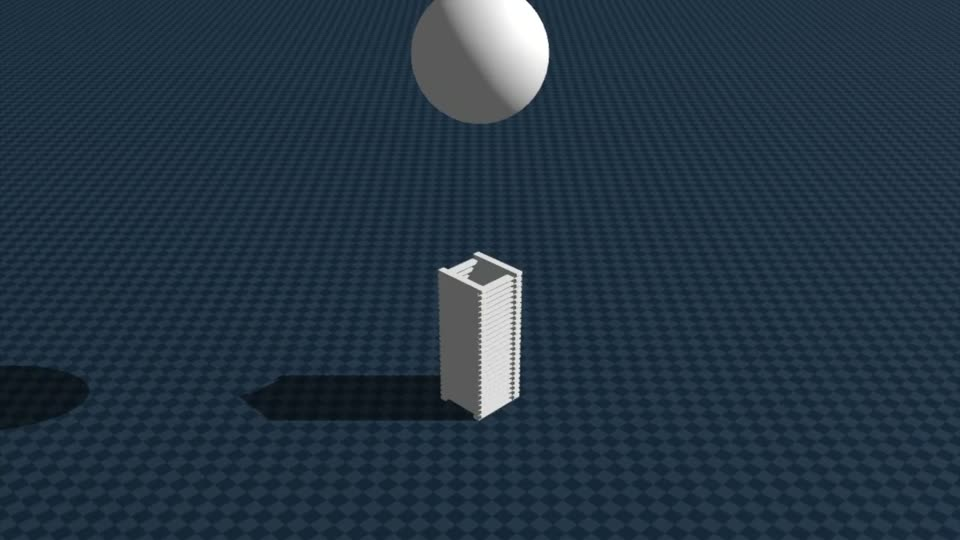</a> 
Demo: <code>genesis_rigid_stack_tower</code> 
规模: 102 刚体，102 约束 
速度: 428.3 FPS，RTF 0.64
</td>
<td>
<a href="video/Newton/newton_rigid_collision_ball_pyramid.mp4">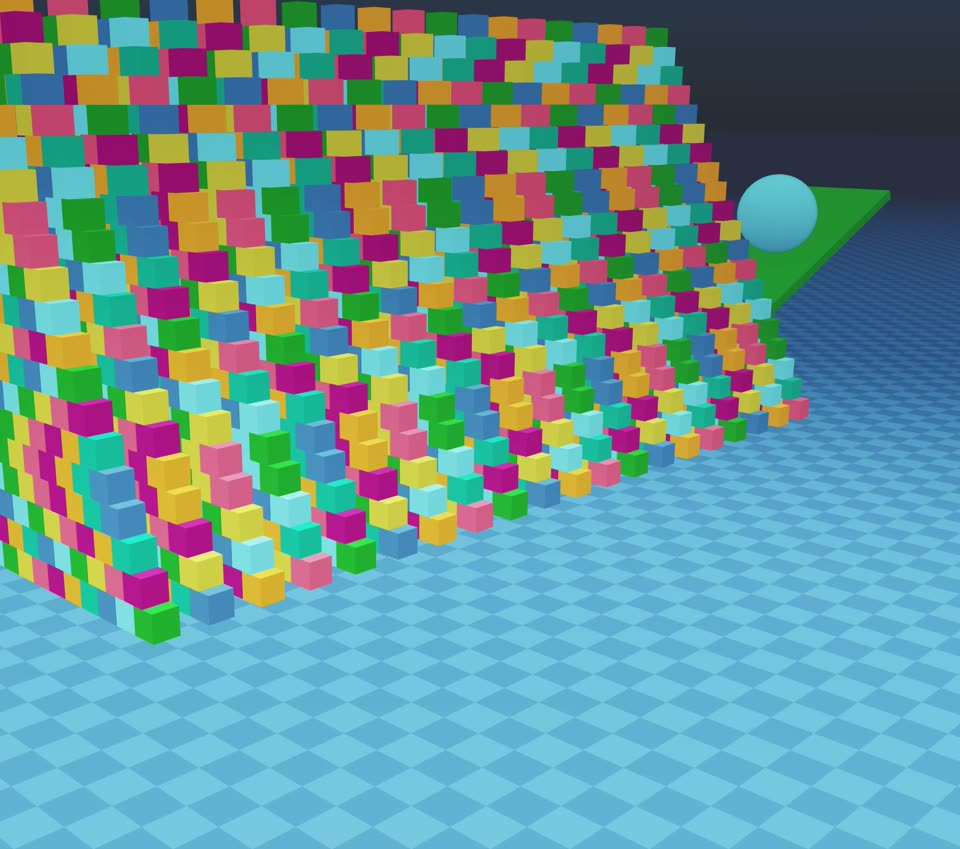</a> 
Demo: <code>newton_rigid_collision_ball_pyramid</code> 
规模: 4,201 刚体，4,201 约束 
速度: 366.4 FPS，RTF 3.66
</td>
</tr>
</table>

**对比：** 两个平台都能稳定运行基础刚体 demo。Genesis 的实现更轻量、复现更快；Newton 的场景更强调高冲击和多接触条件下的刚体求解表现。若只是快速搭建刚体验证，Genesis 效率更高；若后续需要细分约束、接触参数和更复杂刚体系统，Newton 的工程接口更有扩展空间。

---

## 3. Franka 抓取刚体

<table>
<tr>
<th width="50%">Genesis：Franka 抓取立方体</th>
<th width="50%">Newton：Franka 抓取并堆叠</th>
</tr>
<tr>
<td>
<a href="video/Genesis/genesis_robot_franka_pick_cube_rigid.mp4">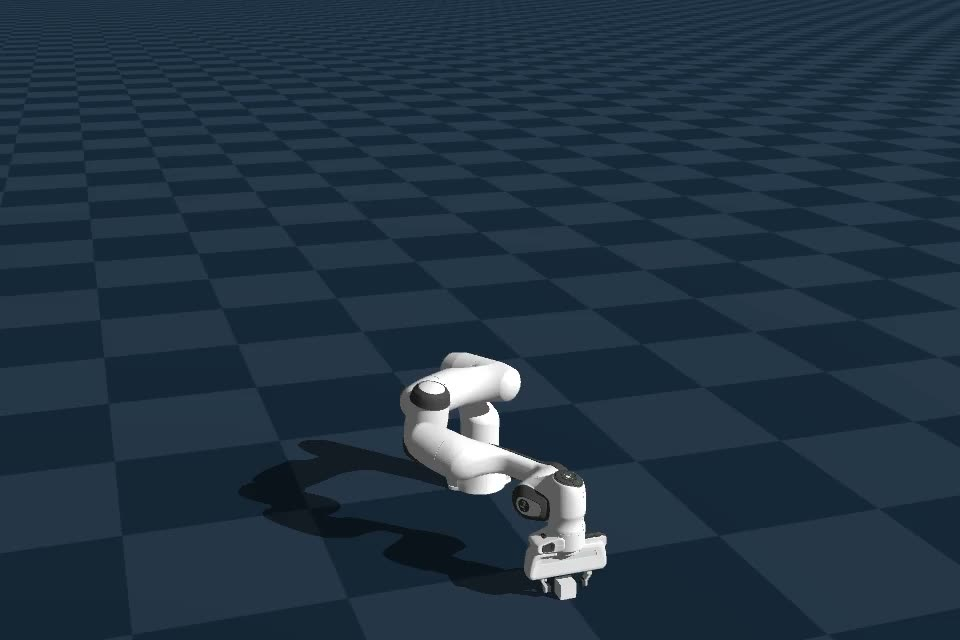</a> 
Demo: <code>genesis_robot_franka_pick_cube_rigid</code> 
规模: 13 刚体，9 robot DoF，11 约束 
速度: 392.3 FPS，RTF 3.92
</td>
<td>
<a href="video/Newton/newton_robot_franka_pick_stack_cube.mp4">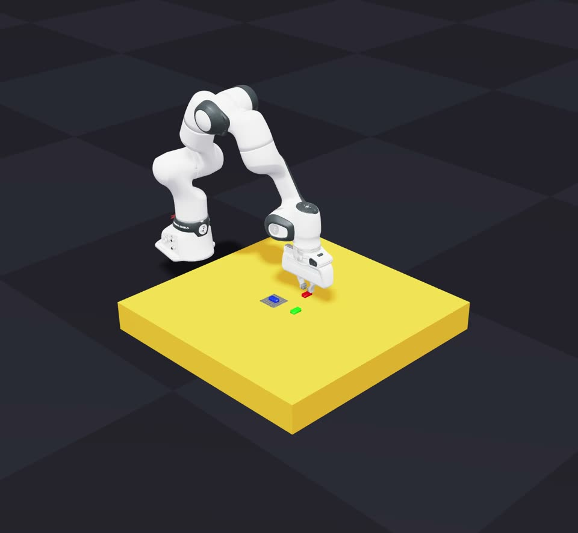</a> 
Demo: <code>newton_robot_franka_pick_stack_cube</code> 
规模: 17 刚体，9 robot DoF，17 约束 
速度: 63.3 FPS，RTF 1.05
</td>
</tr>
</table>

**对比：** 两个平台都能实现机械臂刚体操作。Genesis 更适合快速实现和调试抓取流程；Newton 的任务更接近完整机器人操作 pipeline，效果更丰富，但代码结构、状态机和碰撞设置的理解成本明显更高。

---

## 4. 铰链与关节约束刚体

<table>
<tr>
<th width="50%">Genesis：门铰链</th>
<th width="50%">Newton：基础关节约束</th>
</tr>
<tr>
<td>
<a href="video/Genesis/genesis_rigid_hinge_door_joint.mp4">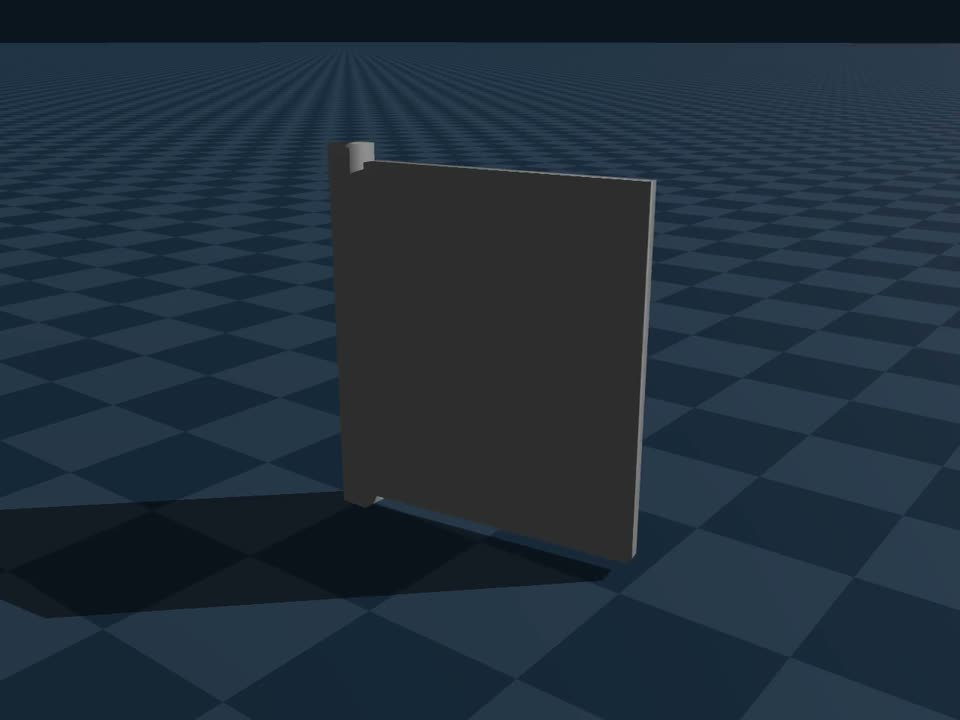</a> 
Demo: <code>genesis_rigid_hinge_door_joint</code> 
规模: 3 刚体，1 DoF，2 约束 
速度: 135.6 FPS，RTF 1.36
</td>
<td>
<a href="video/Newton/newton_rigid_joint_constraints_hinge.mp4">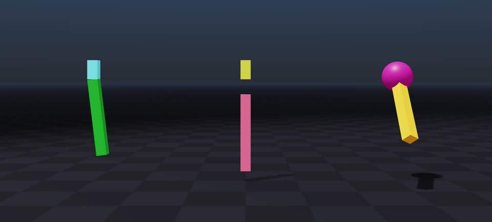</a> 
Demo: <code>newton_rigid_joint_constraints_hinge</code> 
规模: 6 刚体，5 DoF，6 约束 
速度: 911.9 FPS，RTF 9.12
</td>
</tr>
</table>

**对比：** Genesis 的示例更应用导向；Newton 的约束系统展示更完整。若后续需要构造复杂机构、连杆系统或多关节约束，Newton 的表达能力更强；若只需要快速加入常见关节物体，Genesis 更直接。

---

## 5. 机器人关节控制与逆运动学

<table>
<tr>
<th width="50%">Genesis：机器人关节控制</th>
<th width="50%">Newton：机器人关节控制与 IK</th>
</tr>
<tr>
<td>
<a href="video/Genesis/genesis_robot_joint_control_demo.mp4">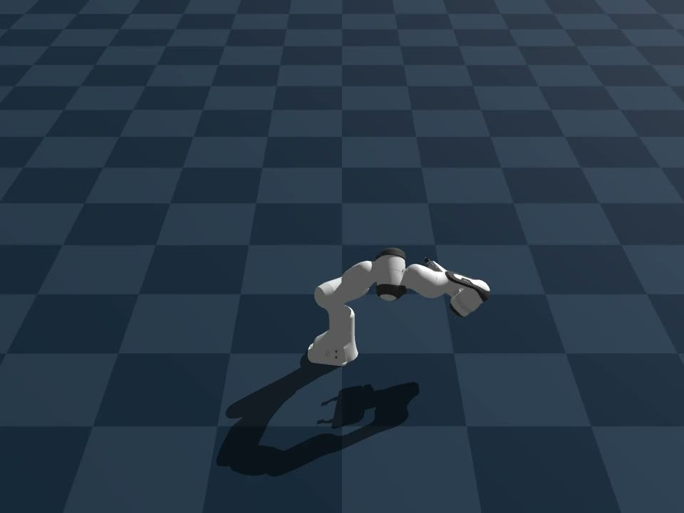</a> 
Demo: <code>genesis_robot_joint_control_demo</code> 
规模: 12 刚体，9 robot DoF，10 约束 
速度: 281.6 FPS，RTF 2.82
</td>
<td>
<a href="video/Newton/newton_robot_ur10_joint_control.mp4">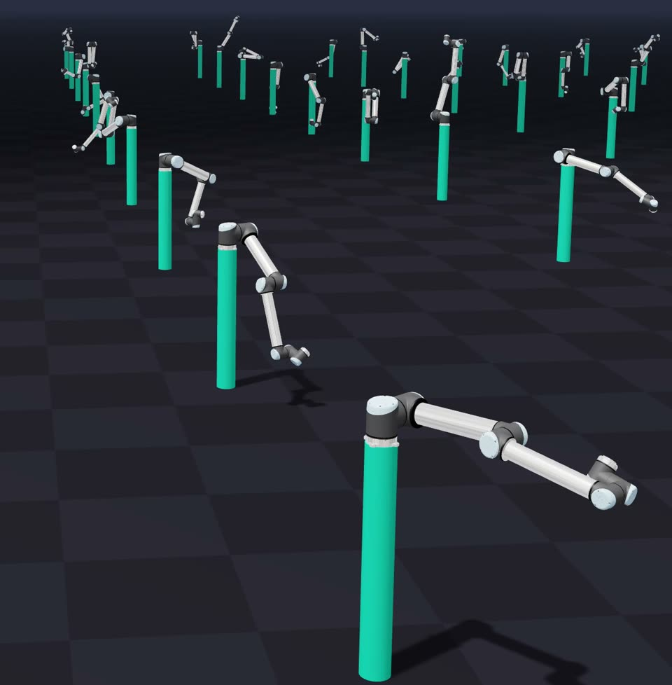</a> 
Demo: <code>newton_robot_ur10_joint_control</code> 
规模: 800 刚体，600 robot DoF，800 约束 
速度: 354.9 FPS，RTF 7.10  
<a href="video/Newton/newton_robot_franka_inverse_kinematics.mp4">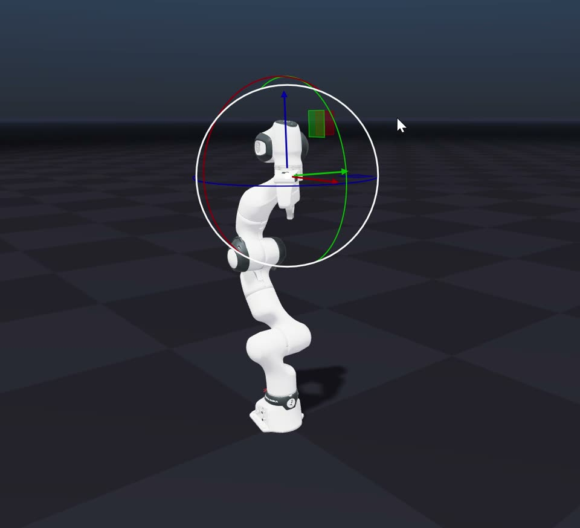</a> 
Demo: <code>newton_robot_franka_inverse_kinematics</code> 
规模: 14 刚体，9 robot DoF，14 约束 
速度: 412.6 FPS，RTF 6.88
</td>
</tr>
</table>

**对比：** Genesis 的机器人控制接口更统一，适合快速做 demo；Newton 的机器人控制链路更细，IK、动力学、关节目标和控制器之间拆分更明确，更适合后续做复杂任务规划、精细控制和机器人-环境耦合。

---

## 6. SPH 液体自由面

<table>
<tr>
<th width="50%">Genesis：SPH 自由液面</th>
<th width="50%">Newton：本轮无直接 SPH 对应项</th>
</tr>
<tr>
<td>
<a href="video/Genesis/genesis_fluid_sph_liquid_free_surface.mp4">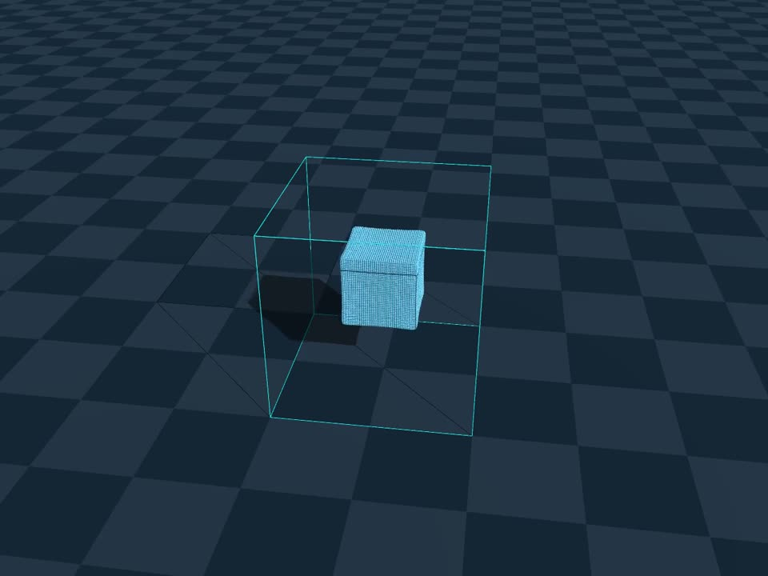</a> 
Demo: <code>genesis_fluid_sph_liquid_free_surface</code> 
规模: 64,000 SPH 粒子，1 刚体边界 
速度: 46.8 FPS，RTF 0.19
</td>
<td>
Newton 当前 demo 组没有直接的 SPH 自由液面视频。对应的流动材料 demo 主要是 MPM 路线，见第 8 节的 `newton_mpm_liquid_viscous_flow`。
</td>
</tr>
</table>

**对比：** 如果后续工作需要真实水感、自由液面或 SPH 风格流体，Genesis 是更自然的选择。Newton 可以做 MPM 流动材料，但它在该类 demo 中表现出的技术路线不是 SPH 水模拟。

---

## 7. PBD 液体

<table>
<tr>
<th width="50%">Genesis：PBD 液体粒子</th>
<th width="50%">Newton：本轮无直接 PBD 液体对应项</th>
</tr>
<tr>
<td>
 
Demo: <code>genesis_fluid_pbd_liquid_particles</code> 
规模: 16,000 PBD 粒子 
速度: 1134.3 FPS，RTF 2.27
</td>
<td>
Newton 虽然有 XPBD 求解器，但本轮液体类视频没有直接复现 PBD 液体。Newton 的粒子/连续介质流动主要放在 MPM demo 中展示。
</td>
</tr>
</table>

**对比：** Genesis 在流体求解器覆盖面上更有优势；Newton 更适合把流动材料纳入 MPM 或多物理耦合框架，而不是作为 PBD 液体 demo 平台。

---

## 8. 流体、颗粒与刚体耦合

<table>
<tr>
<th width="50%">Genesis：SPH/MPM 耦合与颗粒</th>
<th width="50%">Newton：MPM 耦合与黏性流体</th>
</tr>
<tr>
<td>
<a href="video/Genesis/genesis_coupling_sph_liquid_rigid.mp4">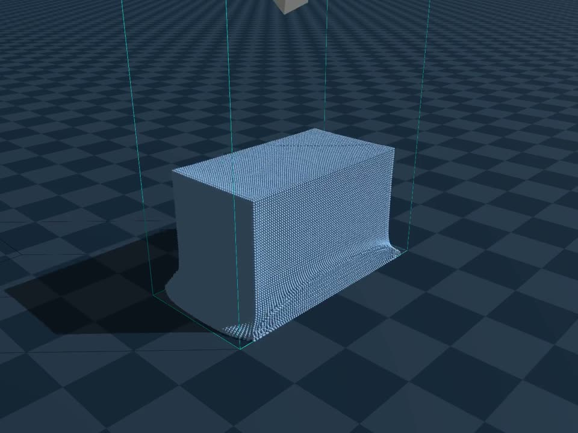</a> 
Demo: <code>genesis_coupling_sph_liquid_rigid</code> 
规模: 216,000 SPH 粒子 + 2 刚体 
速度: 37.9 FPS，RTF 0.38  
<a href="video/Genesis/genesis_mpm_sand_granular.mp4">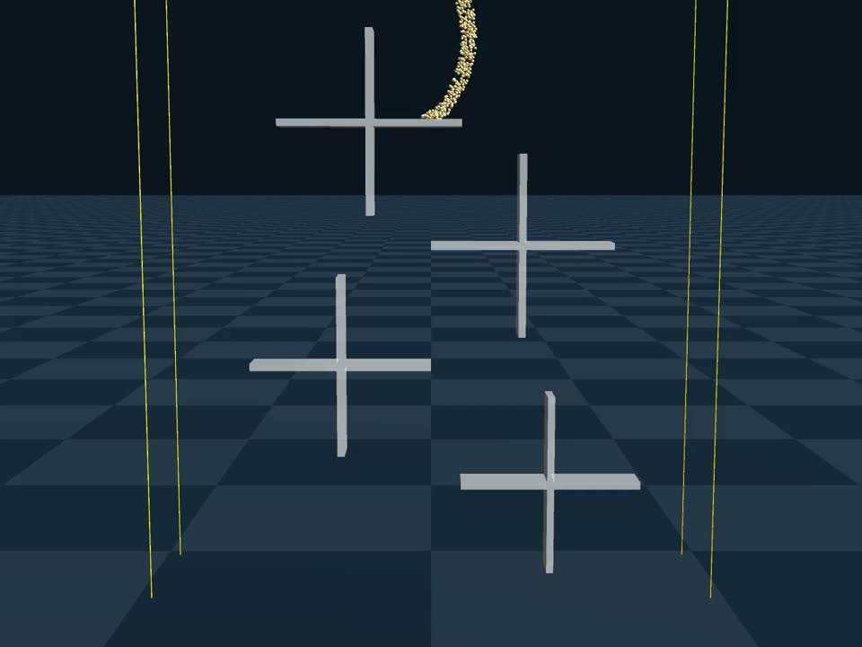</a> 
Demo: <code>genesis_mpm_sand_granular</code> 
规模: 200,000 MPM 粒子 + 5 刚体 
速度: 38.1 FPS，RTF 0.11
</td>
<td>
<a href="video/Newton/newton_coupling_mpm_rigid_twoway.mp4">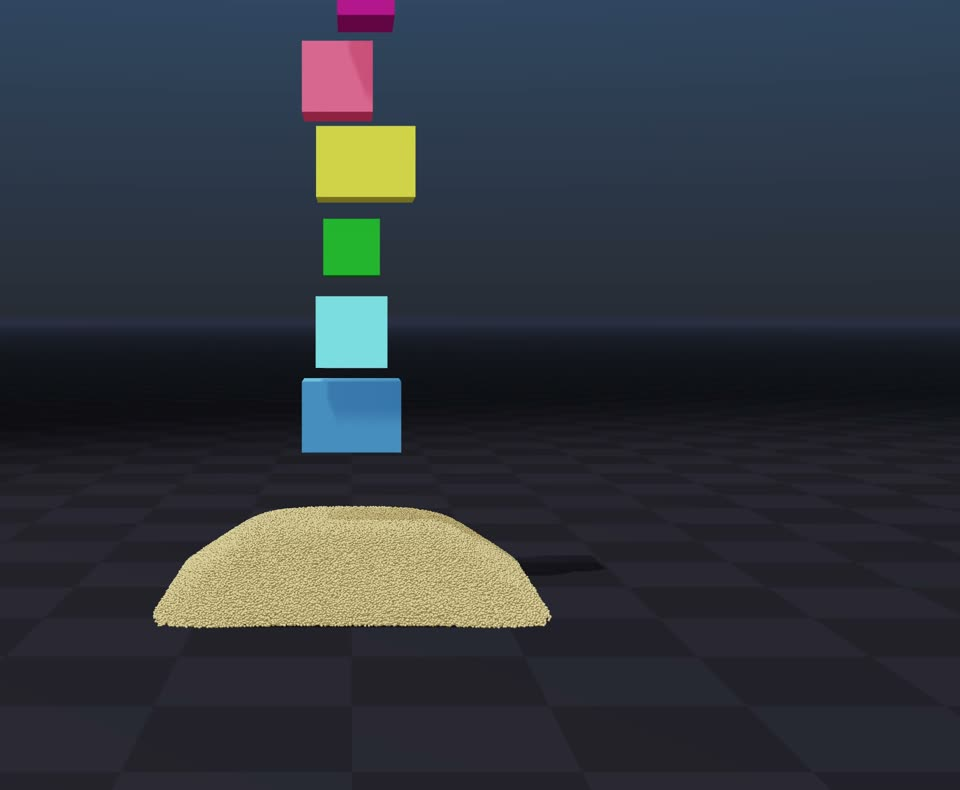</a> 
Demo: <code>newton_coupling_mpm_rigid_twoway</code> 
规模: 453,871 MPM 粒子 + 6 刚体 
速度: 97.9 FPS，RTF 0.98  
<a href="video/Newton/newton_mpm_liquid_viscous_flow.mp4">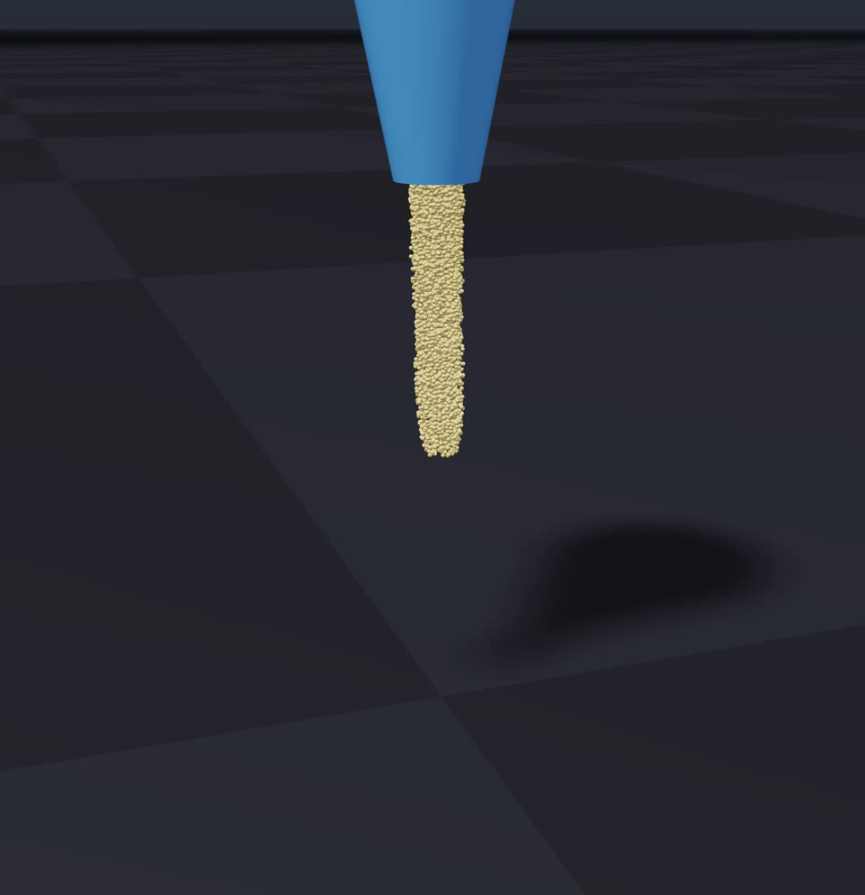</a> 
Demo: <code>newton_mpm_liquid_viscous_flow</code> 
规模: 100,190 MPM 粒子 
速度: 39.4 FPS，RTF 0.16
</td>
</tr>
</table>

**对比：** Genesis 同时覆盖 SPH 与 MPM，流体/颗粒/刚体耦合路径更完整；Newton 的 MPM 耦合工程化程度更高，更适合连续介质、颗粒材料和刚体相互作用。若后续目标是“水”和“低黏度液体”，Genesis 更合适；若目标是沙、泥、软材料或 MPM-刚体作用，Newton 值得继续深入。

---

## 9. MPM 多材料模拟

<table>
<tr>
<th width="50%">Genesis：MPM 多材料</th>
<th width="50%">Newton：MPM 多材料</th>
</tr>
<tr>
<td>
<a href="video/Genesis/genesis_mpm_elastic_liquid_plastic_demo.mp4">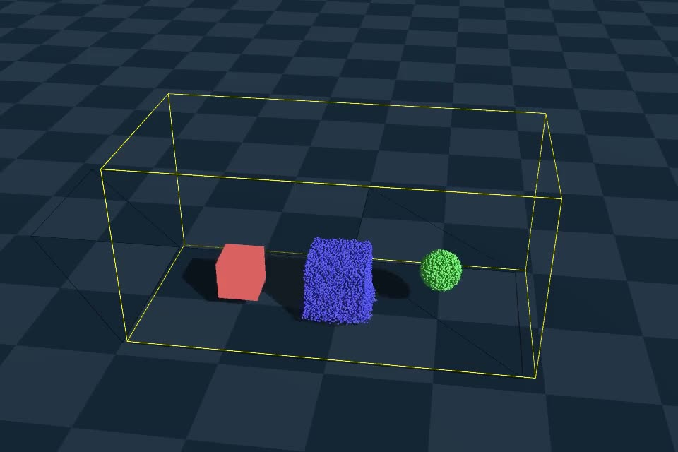</a> 
Demo: <code>genesis_mpm_elastic_liquid_plastic_demo</code> 
规模: 39,184 MPM 粒子 
速度: 48.3 FPS，RTF 0.19
</td>
<td>
<a href="video/Newton/newton_mpm_multi_material_demo.mp4">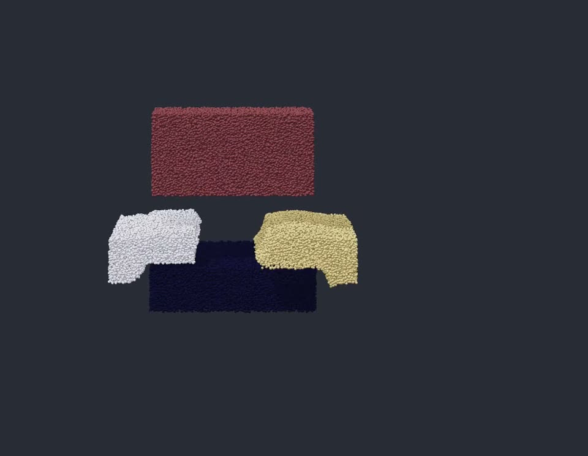</a> 
Demo: <code>newton_mpm_multi_material_demo</code> 
规模: 178,669 MPM 粒子 
速度: 41.4 FPS，RTF 0.69
</td>
</tr>
</table>

**对比：** 两个平台都能跑通 MPM demo。Genesis 更适合快速入门和可视化演示；Newton 的 MPM 路线更偏材料库和工程参数实验，后续若需要系统比较材料模型，Newton 的扩展空间更好。

---

## 10. 固定一侧的下垂布料

<table>
<tr>
<th width="50%">Genesis：PBD 布料</th>
<th width="50%">Newton：XPBD / VBD / Style3D 布料</th>
</tr>
<tr>
<td>
<a href="video/Genesis/genesis_cloth_pbd_hanging_fixed_edge.mp4">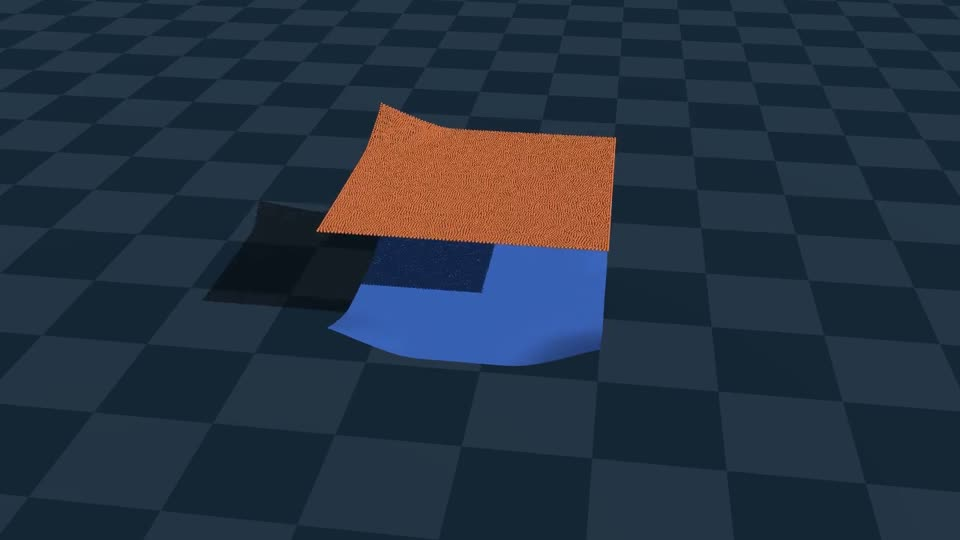</a> 
Demo: <code>genesis_cloth_pbd_hanging_fixed_edge</code> 
规模: 22,414 布料粒子 
速度: 38.5 FPS，RTF 0.15
</td>
<td>
<a href="video/Newton/newton_cloth_xpbd_hanging_fixed_edge.mp4">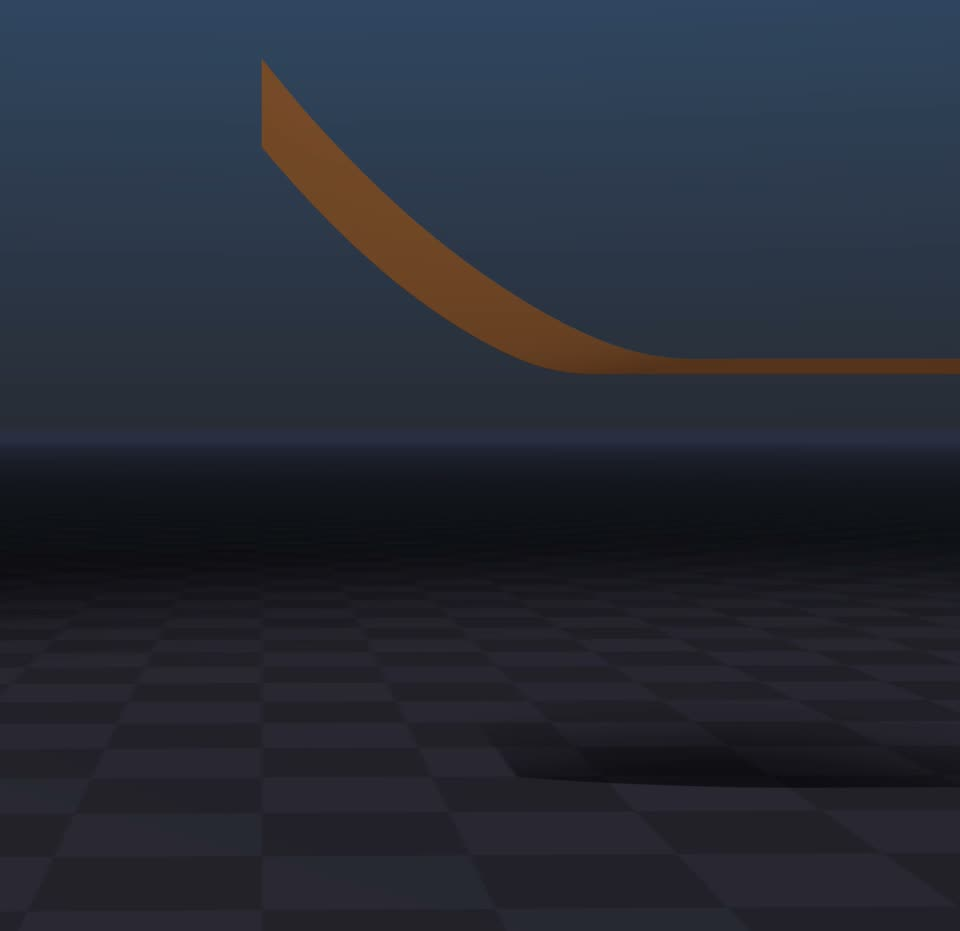</a> 
Demo: <code>newton_cloth_xpbd_hanging_fixed_edge</code> 
规模: 2,145 布料粒子 
速度: 236.7 FPS，RTF 3.95  
<a href="video/Newton/newton_cloth_vbd_hanging_fixed_edge.mp4">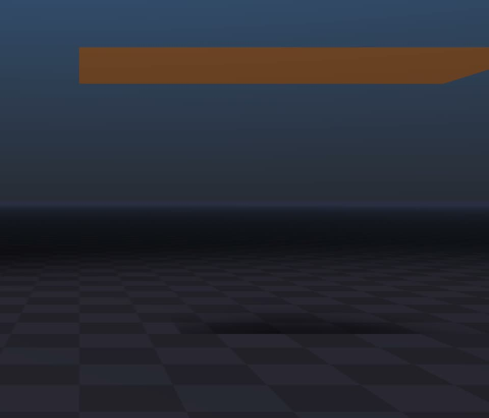</a> 
Demo: <code>newton_cloth_vbd_hanging_fixed_edge</code> 
规模: 2,145 布料粒子 
速度: 73.3 FPS，RTF 1.22  
<a href="video/Newton/newton_cloth_style3d_garment_demo.mp4">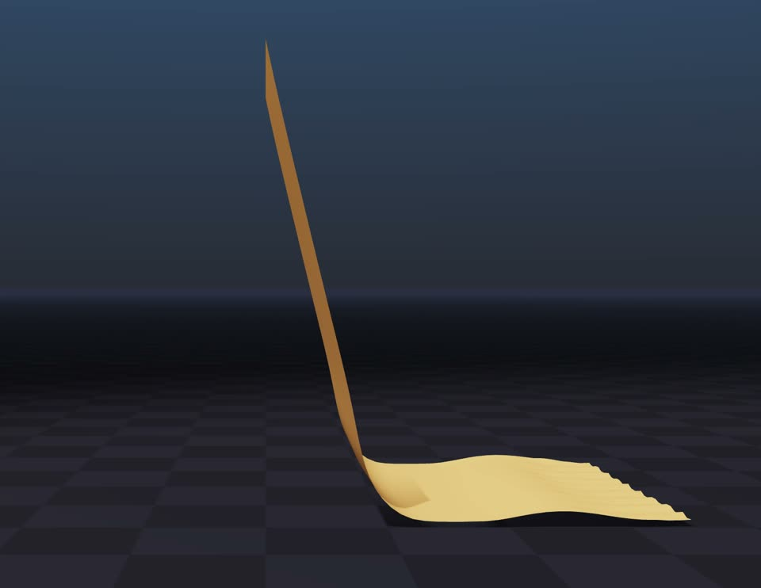</a> 
Demo: <code>newton_cloth_style3d_garment_demo</code> 
规模: 24,510 布料粒子 
速度: 22.1 FPS，RTF 0.37
</td>
</tr>
</table>

**对比：** 布料是 Newton 表现较强的方向。Genesis 的 PBD 布料实现简单、复现快；Newton 可以在 XPBD、VBD 和 Style3D 之间比较求解器效果，适合研究布料精度、稳定性和服装级仿真。不过 Newton 的配置项更多，前期调参和理解成本更高。

---

## 11. 布料与刚体碰撞

<table>
<tr>
<th width="50%">Genesis：布料-刚体碰撞</th>
<th width="50%">Newton：布料-刚体碰撞</th>
</tr>
<tr>
<td>
<a href="video/Genesis/genesis_cloth_rigid_collision.mp4">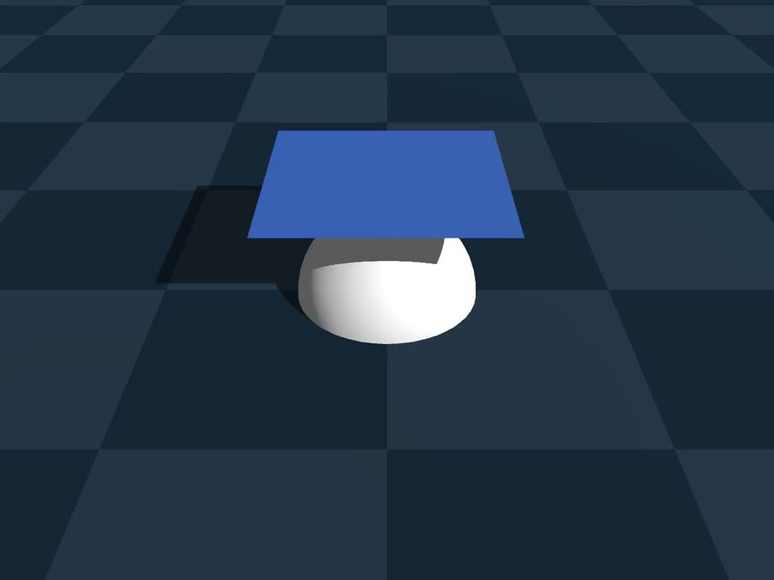</a> 
Demo: <code>genesis_cloth_rigid_collision</code> 
规模: 2,896 布料粒子 + 2 刚体 
速度: 36.6 FPS，RTF 0.07
</td>
<td>
<a href="video/Newton/newton_cloth_rigid_collision.mp4">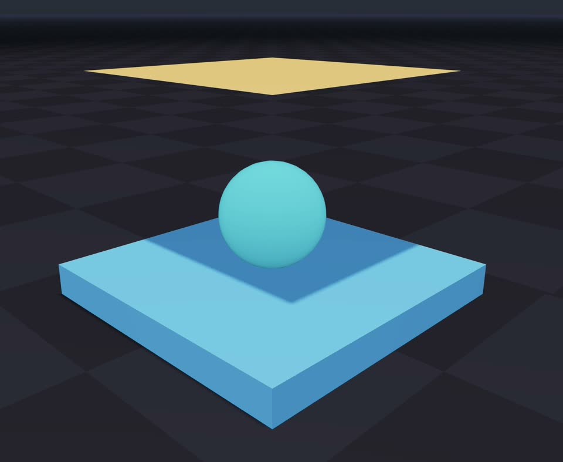</a> 
Demo: <code>newton_cloth_rigid_collision</code> 
规模: 1,681 布料粒子 + 2 刚体 
速度: 6.7 FPS，RTF 0.11
</td>
</tr>
</table>

**对比：** 两个平台都能实现布料-刚体碰撞。Genesis 的场景写法更直接；Newton 的优势在于可以进一步切换求解器、控制接触边界和自碰撞设置，适合对布料接触做更深入调试。

---

## 12. 机械臂抓取软体

<table>
<tr>
<th width="50%">Genesis：Franka 抓 MPM 软立方体</th>
<th width="50%">Newton：Franka 抓 VBD 软体</th>
</tr>
<tr>
<td>
<a href="video/Genesis/genesis_robot_franka_grasp_soft_cube_mpm.mp4">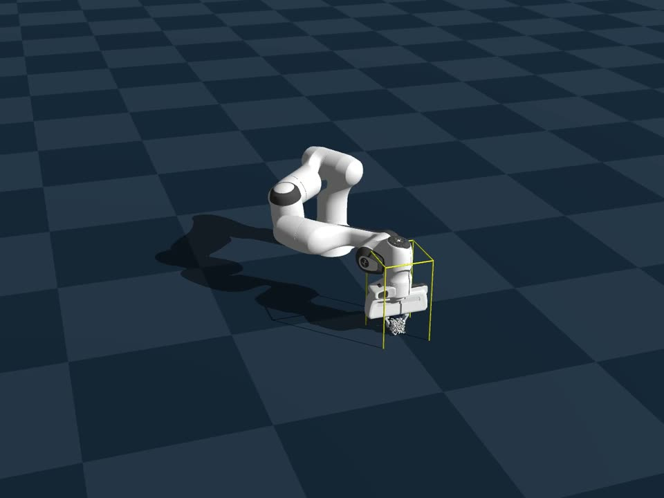</a> 
Demo: <code>genesis_robot_franka_grasp_soft_cube_mpm</code> 
规模: 512 MPM 粒子 + Franka，9 robot DoF 
速度: 17.7 FPS，RTF 0.09
</td>
<td>
<a href="video/Newton/newton_robot_franka_grasp_softbody_vbd.mp4">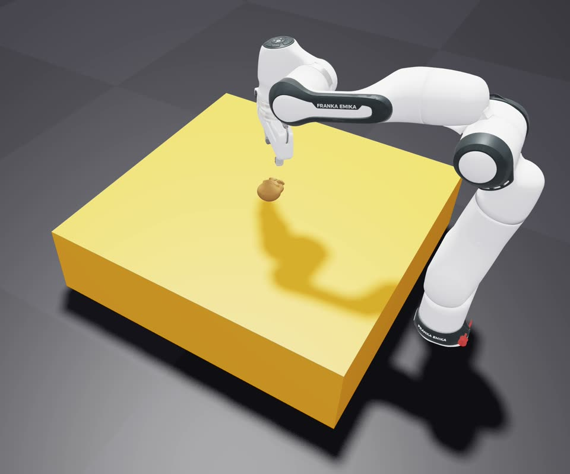</a> 
Demo: <code>newton_robot_franka_grasp_softbody_vbd</code> 
规模: 2,734 VBD 粒子 + Franka，9 robot DoF 
速度: 71.5 FPS，RTF 1.19
</td>
</tr>
</table>

**对比：** 两个平台都能完成机器人-软体交互。Genesis 更适合作为软体抓取快速原型；Newton 在软体网格、机器人控制、接触管线和可变形体求解方面更细，适合后续扩展为复杂可变形物操作任务。

---

## 13. 软体悬挂与 FEM/VBD 表现

<table>
<tr>
<th width="50%">Genesis：FEM 软体变形</th>
<th width="50%">Newton：VBD 软体悬挂</th>
</tr>
<tr>
<td>
<a href="video/Genesis/genesis_softbody_fem_deformation.mp4">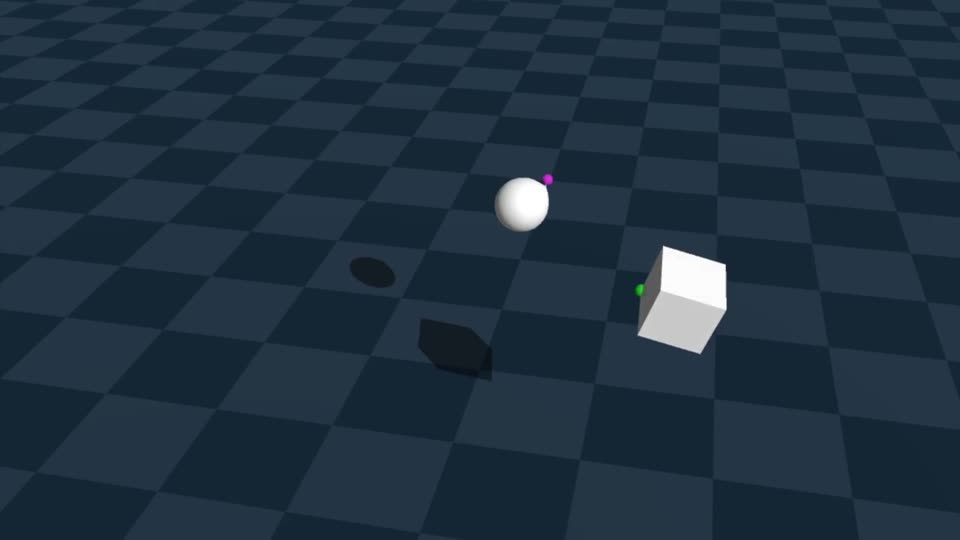</a> 
Demo: <code>genesis_softbody_fem_deformation</code> 
规模: 982 FEM 顶点 
速度: 13.7 FPS，RTF 0.01
</td>
<td>
<a href="video/Newton/newton_softbody_vbd_hanging_damping.mp4">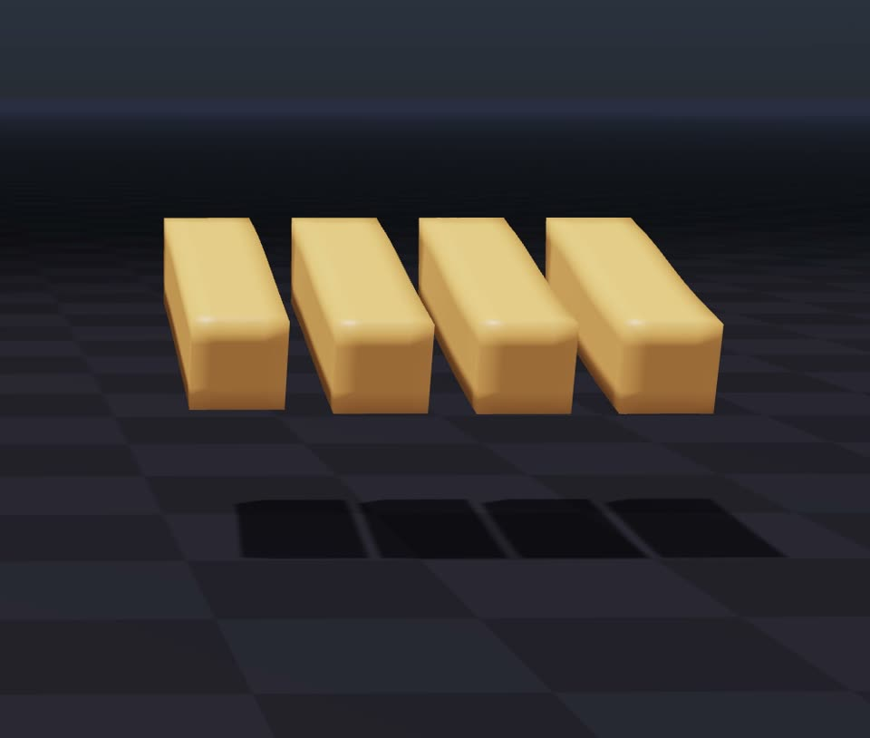</a> 
Demo: <code>newton_softbody_vbd_hanging_damping</code> 
规模: 1,300 VBD 粒子/顶点 
速度: 51.4 FPS，RTF 0.86
</td>
</tr>
</table>

**对比：** Genesis 更接近传统 FEM 软体演示，便于教学和快速观察材料变形；Newton 的 VBD 更强调稳定、可组合以及与机器人/接触系统集成。若后续重点是软体材料本身，Genesis 更直观；若重点是软体与机器人、刚体、布料的复杂交互，Newton 更适合继续投入。

---

## 14. 机器人布料操作与叠衣服

<table>
<tr>
<th width="50%">Genesis：Franka IPC 布料遥操作</th>
<th width="50%">Newton：Franka T-shirt 操作</th>
</tr>
<tr>
<td>
<a href="video/Genesis/genesis_robot_franka_ipc_cloth_teleop.mp4">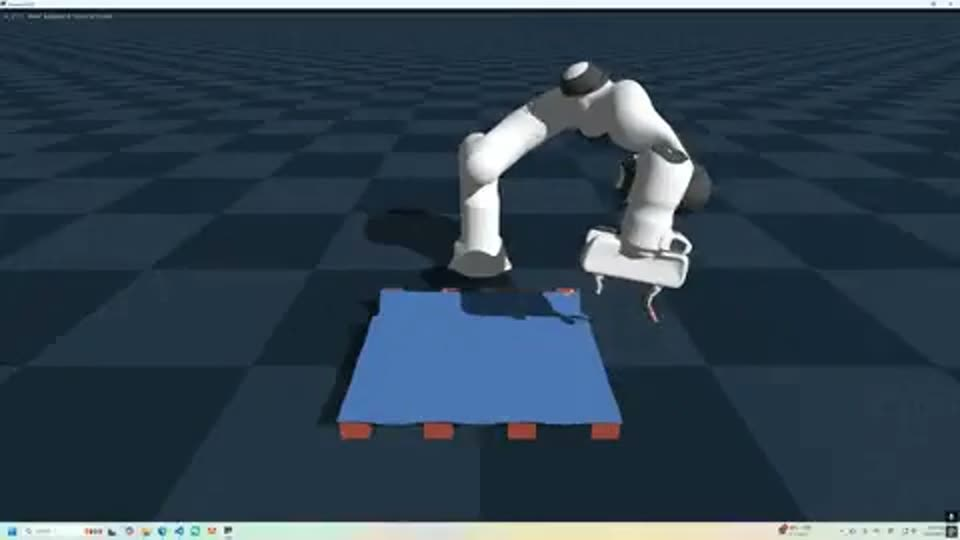</a> 
Demo: <code>genesis_robot_franka_ipc_cloth_teleop</code> 
规模: 800 cloth 顶点 + Franka，9 robot DoF 
速度: 21.9 FPS，RTF 0.44
</td>
<td>
<a href="video/Newton/newton_robot_franka_cloth_tshirt_manipulation.mp4">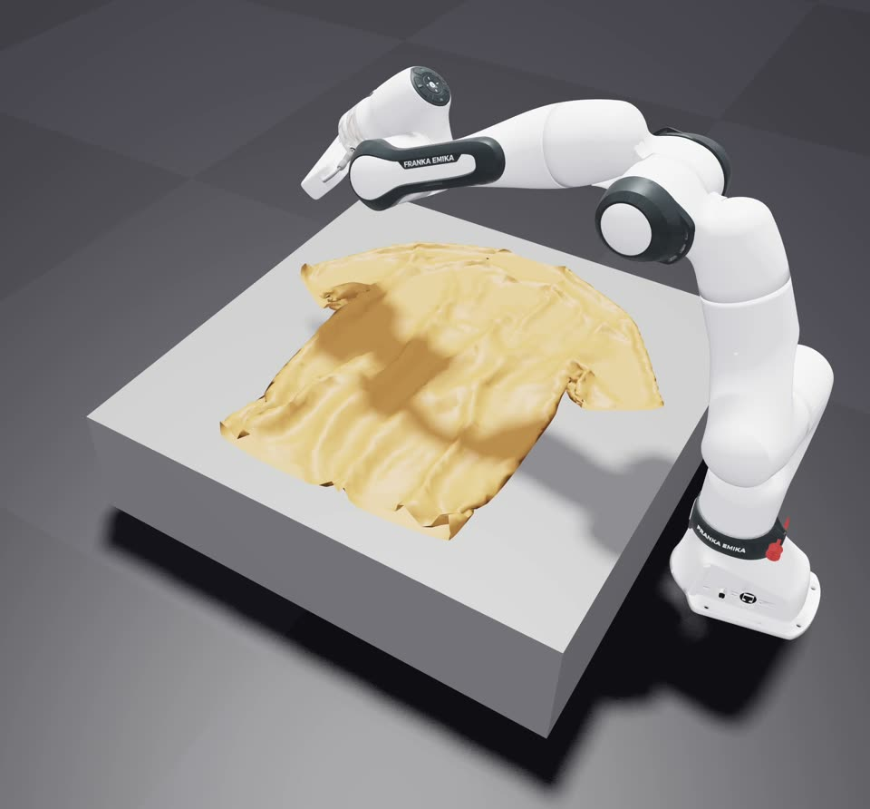</a> 
Demo: <code>newton_robot_franka_cloth_tshirt_manipulation</code> 
规模: 6,436 T-shirt 粒子 + Franka，9 robot DoF 
速度: 65.1 FPS，RTF 1.09
</td>
</tr>
</table>

**对比：** 这是 Newton 相对 Genesis 更有优势的场景之一。Genesis 能跑通机器人与布料交互，接口更统一；Newton 的实现更复杂，但对 T-shirt 这类真实服装网格、机器人控制、布料自碰撞和复杂接触的支持更系统。若后续工作要继续做机器人叠衣服、衣物整理或可变形物操作，Newton 更值得优先考虑。

---

## 15. 场景规模与运行效率统计

每个 demo 的规模和速度已经放回对应视频下方，便于直接按画面对照阅读。所有数据来自 `metrics/scene_metrics.csv`，测量口径统一为 headless simulation loop：关闭 viewer，排除视频录制、截图、渲染、build 和首次编译开销，在短暂 warmup 后只统计 `step()` 循环耗时。FPS 表示纯仿真循环吞吐量；RTF 表示仿真时间/墙钟时间，RTF > 1 代表纯仿真循环快于实时。

从上述逐项对比看，不能简单写成“Genesis 更快”或“Newton 更快”。Genesis 的优势在于覆盖广、上手快，SPH/PBD/MPM/FEM 等多类物理入口统一，尤其适合快速原型和课程展示。Newton 的优势在机器人、关节、VBD/XPBD/Style3D 布料、软体和复杂接触，尤其在机器人-可变形体任务中，常常能在更大场景规模下保持可用吞吐。

---

# 平台能力总结与后续选择建议

## 1. 场景覆盖

Genesis 覆盖面更均衡：刚体、机器人、SPH 液体、PBD 液体、MPM、FEM、布料和多物理耦合都有较直接的示例入口。对于“先确认平台能不能跑经典 demo”这一阶段，Genesis 的效率很高。

Newton 覆盖方向更集中：刚体、机器人、IK、XPBD/VBD/Style3D 布料、VBD 软体、Implicit MPM、多求解器耦合和机器人可变形体操作。它不是流体求解器覆盖最完整的平台，但在机器人和可变形体交互方面更强。

## 2. 实现效率

Genesis 的优势是统一 `Scene`、实体添加和 `scene.step()` 风格，快速复现实验更省时间。大多数 demo 的代码逻辑更直观，适合教学展示和快速搭建 baseline。

Newton 的实现通常需要显式管理 `ModelBuilder`、solver、state、control、collision pipeline、visualization state 等模块。初期实现效率较低，但一旦理解框架，复杂任务的可控性和可扩展性更好。

## 3. 实现效果

在刚体、基础机器人、布料下垂、软体变形等常规 demo 上，两者都能跑通。Genesis 的效果优势在于流体和多求解器组合展示更直观；Newton 的效果优势在于布料/软体接触更细、机器人操作任务更完整，尤其是 Franka 与 T-shirt 布料交互这类复杂场景。

## 4. 求解器路线

Genesis 当前对本组 demo 的覆盖包括刚体、SPH、PBD、MPM、FEM、IPC/布料耦合等，适合比较不同物理求解器在同一平台中的表现。

Newton 当前对本组 demo 的覆盖主要包括 XPBD、VBD、Style3D、Implicit MPM、Featherstone/MuJoCo 机器人动力学和多求解器耦合。它的优势不是“所有物理类型都有最直接入口”，而是把机器人、布料、软体和复杂接触组织成更工程化的系统。

## 5. 在 RTX 5090 上的工作感受

在 5090 上，两个平台的这些 demo 都具备运行条件，且 headless 仿真循环大多可以达到可交互或接近可交互的速度。统计结果显示，轻量刚体、关节和基础机器人场景通常不是瓶颈；真正拉低吞吐的是高粒子数流体/MPM、FEM、布料接触和机器人-可变形体耦合。Genesis 的低门槛让它更快形成可视化结果，Newton 的模块化结构让复杂任务更可控，但需要更多调参、尺度处理和状态管理。

## 6. 建议

如果后续目标是快速扩展经典多物理 demo、覆盖更多流体/软体/刚体组合，或做课程展示型对比，建议优先选择 Genesis。当前数据支持这一点：Genesis 已覆盖 SPH、PBD、MPM、FEM、IPC 布料和机器人耦合等多类入口，其中 PBD 液体、刚体塔和基础机器人 demo 的仿真 FPS 都较高，适合快速迭代。

如果后续目标是机器人叠衣服、机器人操作可变形物、复杂布料接触、服装级仿真或需要精细控制器与求解器组合，建议优先选择 Newton。当前数据也支持这一点：Newton 在 Franka-T-shirt、Franka-软体、VBD 软体、XPBD/VBD/Style3D 布料和 MPM-刚体耦合等场景上提供了更工程化的路线，并在若干复杂场景中保持了更好的吞吐。

综合当前实验和统计结果，可以采用“双平台分工”的策略：Genesis 作为多物理现象覆盖和快速原型平台，Newton 作为机器人-布料/软体复杂操作的重点深入平台。这样既能保留 Genesis 在流体、统一接口和快速搭建上的优势，也能利用 Newton 在复杂机器人可变形体任务上的工程能力。
